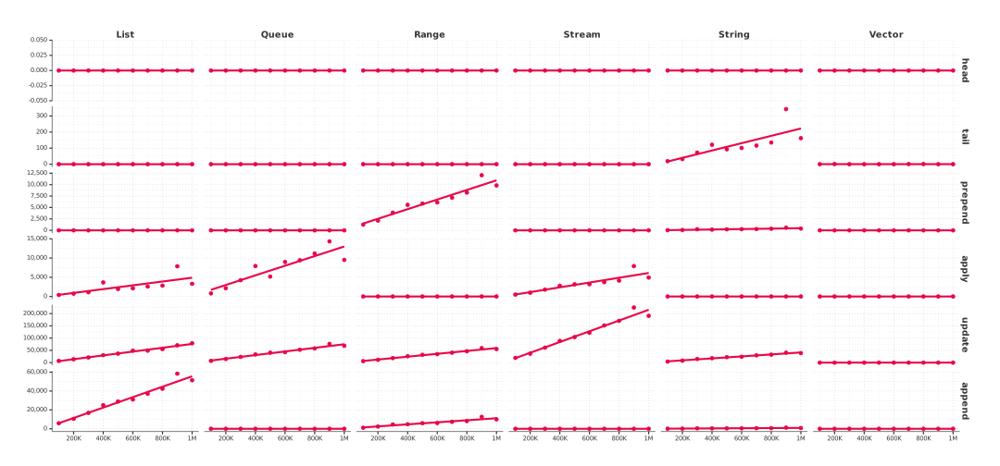
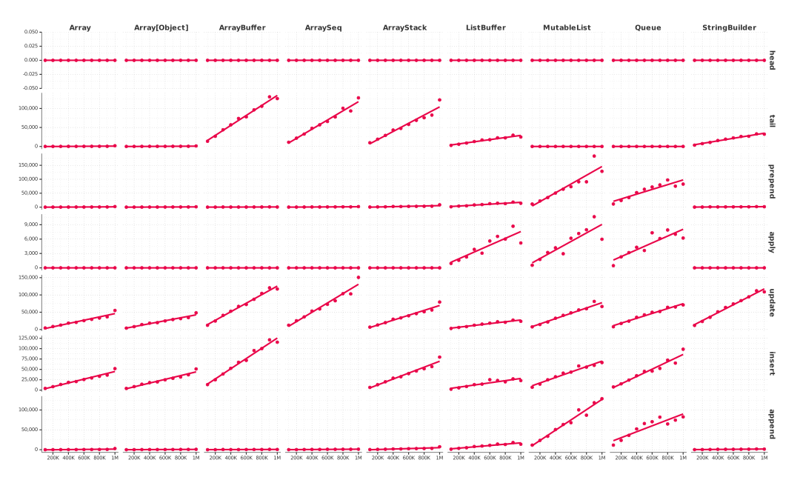
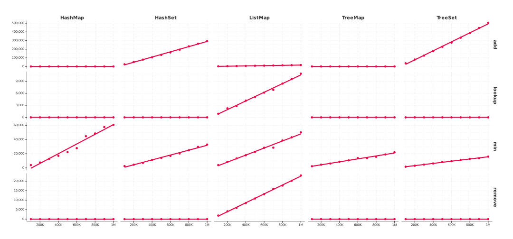
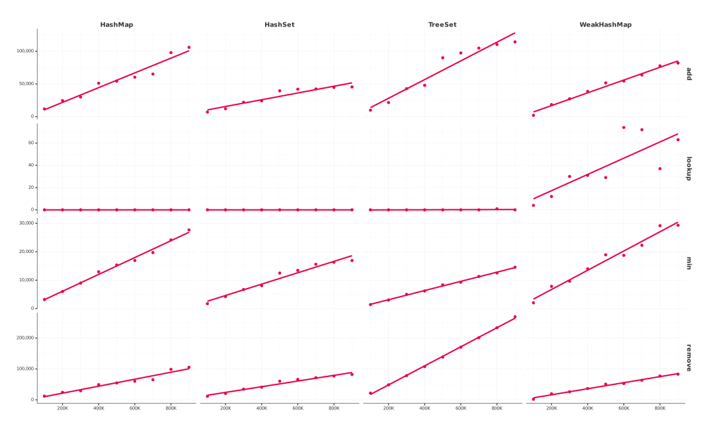

Scala has different data collections and using the proper objects is important in optimizing the big data pipelines. 

This post tries to study the characteristics of the Scala collection, such as:

- Memory Usage,

- Operations Time.

from the point of view of practical benchmarks. 
We will try to study the performance of data collection in two posts; part one related to `Sequence` collection, the second contains `Maps` and `Sets`.
The diagram below demonstrates all of the collections in the package `scala.collection`. These are all high-level abstract classes or traits with both mutable and immutable implementations.

<div class="figure" style="text-align: center">

<p class="caption">Mutable and Immutable Data Collection High-level Abstract Classes or Traits</p>
</div>

## Sequence Type

The `Seq` trait represents sequences. A sequence is a type of iterable with a length and elements with fixed index positions beginning at 0.
`Seq` Collection divided to type of immutable and mutable.
The following figure shows all `Seq` collections in package `scala.collection.immutable`.

<div class="figure" style="text-align: center">

<p class="caption">Immutable Seq Data Collections</p>
</div>

And the following figure shows `Seq` collections in package `scala.collection.mutable`.

<div class="figure" style="text-align: center">

<p class="caption">Mutable Seq Data Collections Part 1</p>
</div>


<div class="figure" style="text-align: center">

<p class="caption">Mutable Seq Data Collections Part 2</p>
</div>


Before seeing the collection benchmark tables, it is useful to review the collection definition and its properties.


```{=html}
<template id="d9a67812-5a6c-4e41-8e6e-9fb39577b6f2"><style>
.tabwid table{
  border-spacing:0px !important;
  border-collapse:collapse;
  line-height:1;
  margin-left:auto;
  margin-right:auto;
  border-width: 0;
  display: table;
  margin-top: 1.275em;
  margin-bottom: 1.275em;
  border-color: transparent;
}
.tabwid_left table{
  margin-left:0;
}
.tabwid_right table{
  margin-right:0;
}
.tabwid td {
    padding: 0;
}
.tabwid a {
  text-decoration: none;
}
.tabwid thead {
    background-color: transparent;
}
.tabwid tfoot {
    background-color: transparent;
}
.tabwid table tr {
background-color: transparent;
}
</style><div class="tabwid"><style>.cl-e2825188{}.cl-e27c1872{font-family:'DejaVu Sans';font-size:11pt;font-weight:normal;font-style:normal;text-decoration:none;color:rgba(0, 0, 0, 1.00);background-color:transparent;}.cl-e27c2e0c{margin:0;text-align:left;border-bottom: 0 solid rgba(0, 0, 0, 1.00);border-top: 0 solid rgba(0, 0, 0, 1.00);border-left: 0 solid rgba(0, 0, 0, 1.00);border-right: 0 solid rgba(0, 0, 0, 1.00);padding-bottom:5pt;padding-top:5pt;padding-left:5pt;padding-right:5pt;line-height: 1;background-color:transparent;}.cl-e27c6b24{width:3049pt;background-color:transparent;vertical-align: middle;border-bottom: 0 solid rgba(0, 0, 0, 1.00);border-top: 0 solid rgba(0, 0, 0, 1.00);border-left: 0 solid rgba(0, 0, 0, 1.00);border-right: 0 solid rgba(0, 0, 0, 1.00);margin-bottom:0;margin-top:0;margin-left:0;margin-right:0;}.cl-e27c6b2e{width:90.2pt;background-color:transparent;vertical-align: middle;border-bottom: 0 solid rgba(0, 0, 0, 1.00);border-top: 0 solid rgba(0, 0, 0, 1.00);border-left: 0 solid rgba(0, 0, 0, 1.00);border-right: 0 solid rgba(0, 0, 0, 1.00);margin-bottom:0;margin-top:0;margin-left:0;margin-right:0;}.cl-e27c6b2f{width:92.3pt;background-color:transparent;vertical-align: middle;border-bottom: 0 solid rgba(0, 0, 0, 1.00);border-top: 0 solid rgba(0, 0, 0, 1.00);border-left: 0 solid rgba(0, 0, 0, 1.00);border-right: 0 solid rgba(0, 0, 0, 1.00);margin-bottom:0;margin-top:0;margin-left:0;margin-right:0;}.cl-e27c6b38{width:92.3pt;background-color:transparent;vertical-align: middle;border-bottom: 2pt solid rgba(102, 102, 102, 1.00);border-top: 0 solid rgba(0, 0, 0, 1.00);border-left: 0 solid rgba(0, 0, 0, 1.00);border-right: 0 solid rgba(0, 0, 0, 1.00);margin-bottom:0;margin-top:0;margin-left:0;margin-right:0;}.cl-e27c6b39{width:3049pt;background-color:transparent;vertical-align: middle;border-bottom: 2pt solid rgba(102, 102, 102, 1.00);border-top: 0 solid rgba(0, 0, 0, 1.00);border-left: 0 solid rgba(0, 0, 0, 1.00);border-right: 0 solid rgba(0, 0, 0, 1.00);margin-bottom:0;margin-top:0;margin-left:0;margin-right:0;}.cl-e27c6b3a{width:90.2pt;background-color:transparent;vertical-align: middle;border-bottom: 2pt solid rgba(102, 102, 102, 1.00);border-top: 0 solid rgba(0, 0, 0, 1.00);border-left: 0 solid rgba(0, 0, 0, 1.00);border-right: 0 solid rgba(0, 0, 0, 1.00);margin-bottom:0;margin-top:0;margin-left:0;margin-right:0;}.cl-e27c6b42{width:92.3pt;background-color:transparent;vertical-align: middle;border-bottom: 2pt solid rgba(102, 102, 102, 1.00);border-top: 2pt solid rgba(102, 102, 102, 1.00);border-left: 0 solid rgba(0, 0, 0, 1.00);border-right: 0 solid rgba(0, 0, 0, 1.00);margin-bottom:0;margin-top:0;margin-left:0;margin-right:0;}.cl-e27c6b43{width:3049pt;background-color:transparent;vertical-align: middle;border-bottom: 2pt solid rgba(102, 102, 102, 1.00);border-top: 2pt solid rgba(102, 102, 102, 1.00);border-left: 0 solid rgba(0, 0, 0, 1.00);border-right: 0 solid rgba(0, 0, 0, 1.00);margin-bottom:0;margin-top:0;margin-left:0;margin-right:0;}.cl-e27c6b4c{width:90.2pt;background-color:transparent;vertical-align: middle;border-bottom: 2pt solid rgba(102, 102, 102, 1.00);border-top: 2pt solid rgba(102, 102, 102, 1.00);border-left: 0 solid rgba(0, 0, 0, 1.00);border-right: 0 solid rgba(0, 0, 0, 1.00);margin-bottom:0;margin-top:0;margin-left:0;margin-right:0;}</style><table class='cl-e2825188'>
```
<caption class="Table Caption">

Collection Types and Descriptions

</caption>
```{=html}
<thead><tr style="overflow-wrap:break-word;"><td class="cl-e27c6b4c"><p class="cl-e27c2e0c"><span class="cl-e27c1872">Immutability</span></p></td><td class="cl-e27c6b42"><p class="cl-e27c2e0c"><span class="cl-e27c1872">Collection</span></p></td><td class="cl-e27c6b43"><p class="cl-e27c2e0c"><span class="cl-e27c1872">description</span></p></td></tr></thead><tbody><tr style="overflow-wrap:break-word;"><td  rowspan="7"class="cl-e27c6b2e"><p class="cl-e27c2e0c"><span class="cl-e27c1872">Immutable</span></p></td><td class="cl-e27c6b2f"><p class="cl-e27c2e0c"><span class="cl-e27c1872">List</span></p></td><td class="cl-e27c6b24"><p class="cl-e27c2e0c"><span class="cl-e27c1872">A List is a collection that contains immutable data. The Scala List class holds a sequenced, linear list of items.</span></p></td></tr><tr style="overflow-wrap:break-word;"><td class="cl-e27c6b2f"><p class="cl-e27c2e0c"><span class="cl-e27c1872">Stream</span></p></td><td class="cl-e27c6b24"><p class="cl-e27c2e0c"><span class="cl-e27c1872">The Stream is a lazy list where elements are evaluated only when they are needed. Streams have the same performance characteristics as lists.</span></p></td></tr><tr style="overflow-wrap:break-word;"><td class="cl-e27c6b2f"><p class="cl-e27c2e0c"><span class="cl-e27c1872">Vector</span></p></td><td class="cl-e27c6b24"><p class="cl-e27c2e0c"><span class="cl-e27c1872">Vectors in Scala are immutable data structures providing random access for elements and is similar to the list. But, the list has incompetence of random access of elements.</span></p></td></tr><tr style="overflow-wrap:break-word;"><td class="cl-e27c6b2f"><p class="cl-e27c2e0c"><span class="cl-e27c1872">Queue</span></p></td><td class="cl-e27c6b24"><p class="cl-e27c2e0c"><span class="cl-e27c1872">A Queue is a first-in, first-out (FIFO) data structure. Scala offers both an immutable queue and a mutable queue. A mutable queue can be updated or extended in place. It means one can change, add, or remove elements of a queue as a side effect. Queue is implemented as a pair of lists. One is used to insert the elements and the second to contain deleted elements. Elements are added to the first list and removed from the second list. The two most basic operations of Queue are Enqueue and Dequeue.</span></p></td></tr><tr style="overflow-wrap:break-word;"><td class="cl-e27c6b2f"><p class="cl-e27c2e0c"><span class="cl-e27c1872">Stack</span></p></td><td class="cl-e27c6b24"><p class="cl-e27c2e0c"><span class="cl-e27c1872">A Stack is a data structure that follows the last-in, first-out(LIFO) principle. We can add or remove element only from one end called top. Scala has both mutable and immutable versions of a stack.</span></p></td></tr><tr style="overflow-wrap:break-word;"><td class="cl-e27c6b2f"><p class="cl-e27c2e0c"><span class="cl-e27c1872">Range</span></p></td><td class="cl-e27c6b24"><p class="cl-e27c2e0c"><span class="cl-e27c1872">The Range can be defined as an organized series of uniformly separated Integers. It is helpful in supplying more strength with fewer methods, so operations performed here are very quick.</span></p></td></tr><tr style="overflow-wrap:break-word;"><td class="cl-e27c6b2f"><p class="cl-e27c2e0c"><span class="cl-e27c1872">String</span></p></td><td class="cl-e27c6b24"><p class="cl-e27c2e0c"><span class="cl-e27c1872">A string is a sequence of characters. In Scala, objects of String are immutable which means they are constant and cannot be changed once created.</span></p></td></tr><tr style="overflow-wrap:break-word;"><td  rowspan="7"class="cl-e27c6b2e"><p class="cl-e27c2e0c"><span class="cl-e27c1872">Mutable</span></p></td><td class="cl-e27c6b2f"><p class="cl-e27c2e0c"><span class="cl-e27c1872">ArrayBuffer</span></p></td><td class="cl-e27c6b24"><p class="cl-e27c2e0c"><span class="cl-e27c1872">To create a mutable, indexed sequence whose size can change, the ArrayBuffer class is used. Internally, an ArrayBuffer is an Array of elements, as well as the store’s current size of the array. When an element is added to an ArrayBuffer, its size is checked. If the underlying array isn’t full, then the element is directly added to the array. If the underlying array is full, then a larger array is constructed and all the elements are copied to the new array. The key is that the new array is constructed larger than what is required for the current addition.</span></p></td></tr><tr style="overflow-wrap:break-word;"><td class="cl-e27c6b2f"><p class="cl-e27c2e0c"><span class="cl-e27c1872">ListBuffer</span></p></td><td class="cl-e27c6b24"><p class="cl-e27c2e0c"><span class="cl-e27c1872">The ListBuffer object is convenient when we want to build a list from front to back. It supports efficient prepend and append operations. The time taken to convert the ListBuffer into a List is constant.</span></p></td></tr><tr style="overflow-wrap:break-word;"><td class="cl-e27c6b2f"><p class="cl-e27c2e0c"><span class="cl-e27c1872">StringBuilder</span></p></td><td class="cl-e27c6b24"><p class="cl-e27c2e0c"><span class="cl-e27c1872">A String object is immutable. When you need to perform repeated modifications to a string, we need a StringBuilder class. A StringBuilder is utilized to append input data to the internal buffer. Numerous operations like appending data, inserting data, and removing data are supported in StringBuilder.</span></p></td></tr><tr style="overflow-wrap:break-word;"><td class="cl-e27c6b2f"><p class="cl-e27c2e0c"><span class="cl-e27c1872">MutableList</span></p></td><td class="cl-e27c6b24"><p class="cl-e27c2e0c"><span class="cl-e27c1872">A MutableList consists of a single linked list together with a pointer that refers to the terminal empty node of that list. This makes list append a constant time operation because it avoids having to traverse the list in search for its terminal node.</span></p></td></tr><tr style="overflow-wrap:break-word;"><td class="cl-e27c6b2f"><p class="cl-e27c2e0c"><span class="cl-e27c1872">ArraySeq</span></p></td><td class="cl-e27c6b24"><p class="cl-e27c2e0c"><span class="cl-e27c1872">Array sequences are mutable sequences of a fixed size that store their elements internally in an Array[Object]. You would typically use an ArraySeq if you want an array for its performance characteristics, but you also want to create generic instances of the sequence where you do not know the type of the elements and you do not have a ClassTag to provide them at run-time.</span></p></td></tr><tr style="overflow-wrap:break-word;"><td class="cl-e27c6b2f"><p class="cl-e27c2e0c"><span class="cl-e27c1872">ArrayStack</span></p></td><td class="cl-e27c6b24"><p class="cl-e27c2e0c"><span class="cl-e27c1872">An ArrayStack is a MutableStack that contains a FastList of data. ArrayStack iterates from top to bottom (LIFO order). The backing data structure grows and shrinks by 50% at a time, and size is constant. ArrayStack does not extend Vector, as does the Java Stack, which was one of the reasons for creating this data structure.</span></p></td></tr><tr style="overflow-wrap:break-word;"><td class="cl-e27c6b38"><p class="cl-e27c2e0c"><span class="cl-e27c1872">Array</span></p></td><td class="cl-e27c6b39"><p class="cl-e27c2e0c"><span class="cl-e27c1872">Array is a special mutable kind of collection in Scala. it is a fixed size data structure that stores elements of the same data type.</span></p></td></tr></tbody></table></div></template>
<div class="flextable-shadow-host" id="1892274c-2afe-49ea-9284-2bbcd8a871b4"></div>
<script>
var dest = document.getElementById("1892274c-2afe-49ea-9284-2bbcd8a871b4");
var template = document.getElementById("d9a67812-5a6c-4e41-8e6e-9fb39577b6f2");
var caption = template.content.querySelector("caption");
if(caption) {
  caption.style.cssText = "display:block;text-align:center;";
  var newcapt = document.createElement("p");
  newcapt.appendChild(caption)
  dest.parentNode.insertBefore(newcapt, dest.previousSibling);
}
var fantome = dest.attachShadow({mode: 'open'});
var templateContent = template.content;
fantome.appendChild(templateContent);
</script>

```

### Benchmark Codes

We created a Scala project with a sbt for assessment data collection.


```sbt
// build.sbt
scalaVersion := "2.12.3"
libraryDependencies += "org.apache.spark" %% "spark-core" % "3.1.2"
libraryDependencies += "org.apache.spark" %% "spark-sql" % "3.1.2"
enablePlugins(PackPlugin)
```

To calculate the size of an object, I find `org.apache.spark.util.SizeEstimator.estimate`  function is useful.
This function estimates the sizes of Java objects (number of bytes of memory they occupy). 


```scala
import org.apache.spark.sql._
import org.apache.spark.sql.functions.col
import org.apache.spark.util.SizeEstimator.estimate
import scala.collection.AbstractSeq
import scala.collection.mutable
import scala.collection.mutable.{ArrayBuffer, ListBuffer}
```

To create a result dataframe and write the result, we use Spark (it is not necessary).


```scala
val spark = SparkSession
  .builder()
  .appName("Collection_Benchmark")
  .master("local[2]")
  .getOrCreate()

import spark.implicits._
```

We need a time-elapsing function to calculate run time, so use 'System.nanoTime` to measure time in nano resolution.


```scala
def timeElapsing(benchmarkFunction: => Unit, message:Boolean = false)(times:Int = 1): Double = {
  if(message) println("Benchmark: IS Starting ...")
  val startTime = System.nanoTime()
  for (_ <- 0 until times)
    benchmarkFunction
  val endTime = System.nanoTime()
  val timeElapsed = (endTime - startTime).toDouble / times.toDouble
  if(message) println(s"Operation Took $timeElapsed ms on average")
  timeElapsed
}
```

Among all the data collections, only some of them have an `insert` method. We define `insertTime` function only for these collections, as you see below.


```scala
def insertTime(x:AbstractSeq[Int], n:Int, m:Int):Double = x match {
  case x:ArrayBuffer[Int] => timeElapsing(x.updated(m,0))(n)
  case x:ListBuffer[Int] => timeElapsing(x.updated(m,0))(n)
  case x:mutable.MutableList[Int] => timeElapsing(x.updated(m,0))(n)
  case x:mutable.Queue[Int] => timeElapsing(x.updated(m,0))(n)
  case x:mutable.ArrayStack[Int] => timeElapsing(x.updated(m,0))(n)
  case _ => -1
}
```

The main parts of the benchmark are `benchmark***` functions, which contain the time-elapsed of the main methods.


```scala
def benchmarkSeq(x:AbstractSeq[Int], n:Int, m:Int): Map[String, Double] = {
  Map(
    "volume" -> estimate(x),
    "head" -> timeElapsing(x.head)(n),
    "tail" -> timeElapsing(x.tail)(n),
    "apply" -> timeElapsing(x.apply(m))(n),
    "update" -> timeElapsing(x.updated(m,0))(n),
    "prepend" -> timeElapsing(0+:x)(n),
    "append" -> timeElapsing(x:+0)(n),
    "insert" -> insertTime(x, n, m)
  )
}
```

Similar to `benchmarkSeq` we define `benchmarkString`, `benchmarkStringBuilder` and
`benchmarkArray` functions.

To calculate correct time elapsing related to Array we define `Array[Object]`


```scala
def obj = new Object()
def benchmarkArrayBoxed(x:Array[Object], n:Int, m:Int): Map[String, Double] =  { Map(
  "volume" -> estimate(x),
  "head" -> timeElapsing(x.head)(n),
  "tail" -> timeElapsing(x.tail)(n),
  "apply" -> timeElapsing(x.apply(m))(n),
  "update" -> timeElapsing(x.updated(m,0))(n),
  "prepend" -> timeElapsing(obj+:x)(n),
  "append" -> timeElapsing(x:+obj)(n),
  "insert" -> timeElapsing(x.updated(m,0))(n))
}
```

When determining the size of objects, we consider two measurements: size and method. Objects with a length of $16^0,16^1,..., 16^5$ are generated to find their size. For checking the performance of methods, objects with a size of $10000, 200000,..., 1000000$ are generated.


```scala
val sizes = ( 0 to 5).map(x => math.pow(16,x).toInt) ++ (1 to 10).map(_*100000)
```

As you can see below, each method is run 100 times on objects, and the results are collected.


```scala
val stats = for(s <- sizes) yield {
  val integers = 0 until s
  List(
    ("Immutable_List", integers.toList),
    ("Immutable_Stream", integers.toStream),
    ("Immutable_Vector", integers.toVector),
    ("Immutable_Queue", scala.collection.immutable.Queue(integers: _*)),
    ("Immutable_Range", integers),
    ("Immutable_String", "1" * s),
    ("Mutable_ArrayBuffer", scala.collection.mutable.ArrayBuffer(integers: _*)),
    ("Mutable_ListBuffer", scala.collection.mutable.ListBuffer(integers: _*)),
    ("Mutable_StringBuilder", new scala.collection.mutable.StringBuilder("1" * s)),
    ("Mutable_MutableList", scala.collection.mutable.MutableList(integers: _*)),
    ("Mutable_Queue", scala.collection.mutable.Queue(integers: _*)),
    ("Mutable_ArraySeq", scala.collection.mutable.ArraySeq(integers: _*)),
    ("Mutable_ArrayStack", scala.collection.mutable.ArrayStack(integers: _*)),
    ("Mutable_Array", integers.toArray),
    ("Mutable_Boxed_Array", {
      val boxedArray = new Array[Object](s)
      var i = 0
      while (i < s) {
        boxedArray(i) = obj; i += 1
      }
      boxedArray
    })

  ).map {
    case (c, cl: AbstractSeq[Int]) => Map("size" -> s.toString, "collection" -> c) ++ 
    benchmarkSeq(cl, 100, s - 1).map(x => (x._1, x._2.toString))
    case (c, cl: Array[Object]) => Map("size" -> s.toString, "collection" -> c) ++ 
    benchmarkArrayBoxed(cl, 100, s - 1).map(x => (x._1, x._2.toString))
    case (c, cl: Array[Int]) => Map("size" -> s.toString, "collection" -> c) ++ 
    benchmarkArray(cl, 100, s - 1).map(x => (x._1, x._2.toString))
    case (c, cl: String) => Map("size" -> s.toString, "collection" -> c) ++ 
    benchmarkString(cl, 100, s - 1).map(x => (x._1, x._2.toString))
    case (c, cl: StringBuilder) => Map("size" -> s.toString, "collection" -> c) ++ 
    benchmarkStringBuilder(cl, 100, s - 1).map(x => (x._1, x._2.toString))
  }
}
```

The last step is writing the results as a csv file with `spark.write`.


```scala
val colNames = stats(0).head.toList.sortBy(_._1).map(_._1)
  .zipWithIndex.map(x => col("value")(x._2).as(x._1))

stats.flatten.map(x => x.toList.sortBy(_._1).map(_._2))
  .toDF.select(colNames:_*)
  .coalesce(1).write.option("header","true").mode("overwrite")
  .csv("./collection_seq_size_benchmark.csv")
```

### Object Size in Memory


The benchmark data is now available! The table below displays the expected size of various collections of different sizes in bytes.

```{=html}
<template id="4a0475f3-c73e-43c6-810c-b6fe3114a9a0"><style>
.tabwid table{
  border-spacing:0px !important;
  border-collapse:collapse;
  line-height:1;
  margin-left:auto;
  margin-right:auto;
  border-width: 0;
  display: table;
  margin-top: 1.275em;
  margin-bottom: 1.275em;
  border-color: transparent;
}
.tabwid_left table{
  margin-left:0;
}
.tabwid_right table{
  margin-right:0;
}
.tabwid td {
    padding: 0;
}
.tabwid a {
  text-decoration: none;
}
.tabwid thead {
    background-color: transparent;
}
.tabwid tfoot {
    background-color: transparent;
}
.tabwid table tr {
background-color: transparent;
}
</style><div class="tabwid"><style>.cl-e2e499ec{}.cl-e2dec666{font-family:'DejaVu Sans';font-size:11pt;font-weight:bold;font-style:normal;text-decoration:none;color:rgba(0, 0, 0, 1.00);background-color:transparent;}.cl-e2dec670{font-family:'DejaVu Sans';font-size:11pt;font-weight:normal;font-style:normal;text-decoration:none;color:rgba(0, 0, 0, 1.00);background-color:transparent;}.cl-e2ded5fc{margin:0;text-align:left;border-bottom: 0 solid rgba(0, 0, 0, 1.00);border-top: 0 solid rgba(0, 0, 0, 1.00);border-left: 0 solid rgba(0, 0, 0, 1.00);border-right: 0 solid rgba(0, 0, 0, 1.00);padding-bottom:5pt;padding-top:5pt;padding-left:5pt;padding-right:5pt;line-height: 1;background-color:transparent;}.cl-e2ded5fd{margin:0;text-align:right;border-bottom: 0 solid rgba(0, 0, 0, 1.00);border-top: 0 solid rgba(0, 0, 0, 1.00);border-left: 0 solid rgba(0, 0, 0, 1.00);border-right: 0 solid rgba(0, 0, 0, 1.00);padding-bottom:5pt;padding-top:5pt;padding-left:5pt;padding-right:5pt;line-height: 1;background-color:transparent;}.cl-e2df2764{width:54pt;background-color:transparent;vertical-align: middle;border-bottom: 0.5pt solid rgba(102, 102, 102, 1.00);border-top: 0 solid rgba(0, 0, 0, 1.00);border-left: 0 solid rgba(0, 0, 0, 1.00);border-right: 0 solid rgba(0, 0, 0, 1.00);margin-bottom:0;margin-top:0;margin-left:0;margin-right:0;}.cl-e2df276e{width:54pt;background-color:transparent;vertical-align: middle;border-bottom: 0.5pt solid rgba(102, 102, 102, 1.00);border-top: 0 solid rgba(0, 0, 0, 1.00);border-left: 0 solid rgba(0, 0, 0, 1.00);border-right: 0 solid rgba(0, 0, 0, 1.00);margin-bottom:0;margin-top:0;margin-left:0;margin-right:0;}.cl-e2df276f{width:54pt;background-color:transparent;vertical-align: middle;border-bottom: 0.5pt solid rgba(102, 102, 102, 1.00);border-top: 0.5pt solid rgba(102, 102, 102, 1.00);border-left: 0 solid rgba(0, 0, 0, 1.00);border-right: 0 solid rgba(0, 0, 0, 1.00);margin-bottom:0;margin-top:0;margin-left:0;margin-right:0;}.cl-e2df2778{width:54pt;background-color:transparent;vertical-align: middle;border-bottom: 0.5pt solid rgba(102, 102, 102, 1.00);border-top: 0.5pt solid rgba(102, 102, 102, 1.00);border-left: 0 solid rgba(0, 0, 0, 1.00);border-right: 0 solid rgba(0, 0, 0, 1.00);margin-bottom:0;margin-top:0;margin-left:0;margin-right:0;}.cl-e2df2779{width:54pt;background-color:transparent;vertical-align: middle;border-bottom: 2pt solid rgba(102, 102, 102, 1.00);border-top: 0.5pt solid rgba(102, 102, 102, 1.00);border-left: 0 solid rgba(0, 0, 0, 1.00);border-right: 0 solid rgba(0, 0, 0, 1.00);margin-bottom:0;margin-top:0;margin-left:0;margin-right:0;}.cl-e2df2782{width:54pt;background-color:transparent;vertical-align: middle;border-bottom: 2pt solid rgba(102, 102, 102, 1.00);border-top: 0.5pt solid rgba(102, 102, 102, 1.00);border-left: 0 solid rgba(0, 0, 0, 1.00);border-right: 0 solid rgba(0, 0, 0, 1.00);margin-bottom:0;margin-top:0;margin-left:0;margin-right:0;}.cl-e2df278c{width:54pt;background-color:transparent;vertical-align: middle;border-bottom: 2pt solid rgba(102, 102, 102, 1.00);border-top: 2pt solid rgba(102, 102, 102, 1.00);border-left: 0 solid rgba(0, 0, 0, 1.00);border-right: 0 solid rgba(0, 0, 0, 1.00);margin-bottom:0;margin-top:0;margin-left:0;margin-right:0;}.cl-e2df278d{width:54pt;background-color:transparent;vertical-align: middle;border-bottom: 2pt solid rgba(102, 102, 102, 1.00);border-top: 2pt solid rgba(102, 102, 102, 1.00);border-left: 0 solid rgba(0, 0, 0, 1.00);border-right: 0 solid rgba(0, 0, 0, 1.00);margin-bottom:0;margin-top:0;margin-left:0;margin-right:0;}</style><table class='cl-e2e499ec'>
```
<caption class="Table Caption">

Estimated Size of Scala  Collections[Int] In Different Size (in bytes)

</caption>
```{=html}
<thead><tr style="overflow-wrap:break-word;"><td class="cl-e2df278d"><p class="cl-e2ded5fc"><span class="cl-e2dec666">Immutability</span></p></td><td class="cl-e2df278d"><p class="cl-e2ded5fc"><span class="cl-e2dec666">Collection</span></p></td><td class="cl-e2df278c"><p class="cl-e2ded5fd"><span class="cl-e2dec666">1</span></p></td><td class="cl-e2df278c"><p class="cl-e2ded5fd"><span class="cl-e2dec666">16</span></p></td><td class="cl-e2df278c"><p class="cl-e2ded5fd"><span class="cl-e2dec666">256</span></p></td><td class="cl-e2df278c"><p class="cl-e2ded5fd"><span class="cl-e2dec666">4,096</span></p></td><td class="cl-e2df278c"><p class="cl-e2ded5fd"><span class="cl-e2dec666">65,536</span></p></td><td class="cl-e2df278c"><p class="cl-e2ded5fd"><span class="cl-e2dec666">1,048,576</span></p></td></tr></thead><tbody><tr style="overflow-wrap:break-word;"><td  rowspan="6"class="cl-e2df276e"><p class="cl-e2ded5fc"><span class="cl-e2dec670">Immutable</span></p></td><td class="cl-e2df276e"><p class="cl-e2ded5fc"><span class="cl-e2dec670">List</span></p></td><td class="cl-e2df2764"><p class="cl-e2ded5fd"><span class="cl-e2dec670">56</span></p></td><td class="cl-e2df2764"><p class="cl-e2ded5fd"><span class="cl-e2dec670">656</span></p></td><td class="cl-e2df2764"><p class="cl-e2ded5fd"><span class="cl-e2dec670">10,256</span></p></td><td class="cl-e2df2764"><p class="cl-e2ded5fd"><span class="cl-e2dec670">163,856</span></p></td><td class="cl-e2df2764"><p class="cl-e2ded5fd"><span class="cl-e2dec670">2,621,456</span></p></td><td class="cl-e2df2764"><p class="cl-e2ded5fd"><span class="cl-e2dec670">41,943,056</span></p></td></tr><tr style="overflow-wrap:break-word;"><td class="cl-e2df276f"><p class="cl-e2ded5fc"><span class="cl-e2dec670">Queue</span></p></td><td class="cl-e2df2778"><p class="cl-e2ded5fd"><span class="cl-e2dec670">80</span></p></td><td class="cl-e2df2778"><p class="cl-e2ded5fd"><span class="cl-e2dec670">680</span></p></td><td class="cl-e2df2778"><p class="cl-e2ded5fd"><span class="cl-e2dec670">10,280</span></p></td><td class="cl-e2df2778"><p class="cl-e2ded5fd"><span class="cl-e2dec670">163,880</span></p></td><td class="cl-e2df2778"><p class="cl-e2ded5fd"><span class="cl-e2dec670">2,621,480</span></p></td><td class="cl-e2df2778"><p class="cl-e2ded5fd"><span class="cl-e2dec670">41,943,080</span></p></td></tr><tr style="overflow-wrap:break-word;"><td class="cl-e2df276f"><p class="cl-e2ded5fc"><span class="cl-e2dec670">Range</span></p></td><td class="cl-e2df2778"><p class="cl-e2ded5fd"><span class="cl-e2dec670">40</span></p></td><td class="cl-e2df2778"><p class="cl-e2ded5fd"><span class="cl-e2dec670">40</span></p></td><td class="cl-e2df2778"><p class="cl-e2ded5fd"><span class="cl-e2dec670">40</span></p></td><td class="cl-e2df2778"><p class="cl-e2ded5fd"><span class="cl-e2dec670">40</span></p></td><td class="cl-e2df2778"><p class="cl-e2ded5fd"><span class="cl-e2dec670">40</span></p></td><td class="cl-e2df2778"><p class="cl-e2ded5fd"><span class="cl-e2dec670">40</span></p></td></tr><tr style="overflow-wrap:break-word;"><td class="cl-e2df276f"><p class="cl-e2ded5fc"><span class="cl-e2dec670">Stream</span></p></td><td class="cl-e2df2778"><p class="cl-e2ded5fd"><span class="cl-e2dec670">120</span></p></td><td class="cl-e2df2778"><p class="cl-e2ded5fd"><span class="cl-e2dec670">120</span></p></td><td class="cl-e2df2778"><p class="cl-e2ded5fd"><span class="cl-e2dec670">120</span></p></td><td class="cl-e2df2778"><p class="cl-e2ded5fd"><span class="cl-e2dec670">120</span></p></td><td class="cl-e2df2778"><p class="cl-e2ded5fd"><span class="cl-e2dec670">120</span></p></td><td class="cl-e2df2778"><p class="cl-e2ded5fd"><span class="cl-e2dec670">120</span></p></td></tr><tr style="overflow-wrap:break-word;"><td class="cl-e2df276f"><p class="cl-e2ded5fc"><span class="cl-e2dec670">String</span></p></td><td class="cl-e2df2778"><p class="cl-e2ded5fd"><span class="cl-e2dec670">48</span></p></td><td class="cl-e2df2778"><p class="cl-e2ded5fd"><span class="cl-e2dec670">72</span></p></td><td class="cl-e2df2778"><p class="cl-e2ded5fd"><span class="cl-e2dec670">552</span></p></td><td class="cl-e2df2778"><p class="cl-e2ded5fd"><span class="cl-e2dec670">8,232</span></p></td><td class="cl-e2df2778"><p class="cl-e2ded5fd"><span class="cl-e2dec670">131,112</span></p></td><td class="cl-e2df2778"><p class="cl-e2ded5fd"><span class="cl-e2dec670">2,097,192</span></p></td></tr><tr style="overflow-wrap:break-word;"><td class="cl-e2df276f"><p class="cl-e2ded5fc"><span class="cl-e2dec670">Vector</span></p></td><td class="cl-e2df2778"><p class="cl-e2ded5fd"><span class="cl-e2dec670">216</span></p></td><td class="cl-e2df2778"><p class="cl-e2ded5fd"><span class="cl-e2dec670">456</span></p></td><td class="cl-e2df2778"><p class="cl-e2ded5fd"><span class="cl-e2dec670">5,448</span></p></td><td class="cl-e2df2778"><p class="cl-e2ded5fd"><span class="cl-e2dec670">84,744</span></p></td><td class="cl-e2df2778"><p class="cl-e2ded5fd"><span class="cl-e2dec670">1,353,192</span></p></td><td class="cl-e2df2778"><p class="cl-e2ded5fd"><span class="cl-e2dec670">21,648,072</span></p></td></tr><tr style="overflow-wrap:break-word;"><td  rowspan="9"class="cl-e2df2779"><p class="cl-e2ded5fc"><span class="cl-e2dec670">Mutable</span></p></td><td class="cl-e2df276f"><p class="cl-e2ded5fc"><span class="cl-e2dec670">Array</span></p></td><td class="cl-e2df2778"><p class="cl-e2ded5fd"><span class="cl-e2dec670">24</span></p></td><td class="cl-e2df2778"><p class="cl-e2ded5fd"><span class="cl-e2dec670">80</span></p></td><td class="cl-e2df2778"><p class="cl-e2ded5fd"><span class="cl-e2dec670">1,040</span></p></td><td class="cl-e2df2778"><p class="cl-e2ded5fd"><span class="cl-e2dec670">16,400</span></p></td><td class="cl-e2df2778"><p class="cl-e2ded5fd"><span class="cl-e2dec670">262,160</span></p></td><td class="cl-e2df2778"><p class="cl-e2ded5fd"><span class="cl-e2dec670">4,194,320</span></p></td></tr><tr style="overflow-wrap:break-word;"><td class="cl-e2df276f"><p class="cl-e2ded5fc"><span class="cl-e2dec670">Array[Object]</span></p></td><td class="cl-e2df2778"><p class="cl-e2ded5fd"><span class="cl-e2dec670">40</span></p></td><td class="cl-e2df2778"><p class="cl-e2ded5fd"><span class="cl-e2dec670">336</span></p></td><td class="cl-e2df2778"><p class="cl-e2ded5fd"><span class="cl-e2dec670">5,136</span></p></td><td class="cl-e2df2778"><p class="cl-e2ded5fd"><span class="cl-e2dec670">80,400</span></p></td><td class="cl-e2df2778"><p class="cl-e2ded5fd"><span class="cl-e2dec670">1,310,160</span></p></td><td class="cl-e2df2778"><p class="cl-e2ded5fd"><span class="cl-e2dec670">20,970,320</span></p></td></tr><tr style="overflow-wrap:break-word;"><td class="cl-e2df276f"><p class="cl-e2ded5fc"><span class="cl-e2dec670">ArrayBuffer</span></p></td><td class="cl-e2df2778"><p class="cl-e2ded5fd"><span class="cl-e2dec670">120</span></p></td><td class="cl-e2df2778"><p class="cl-e2ded5fd"><span class="cl-e2dec670">360</span></p></td><td class="cl-e2df2778"><p class="cl-e2ded5fd"><span class="cl-e2dec670">5,160</span></p></td><td class="cl-e2df2778"><p class="cl-e2ded5fd"><span class="cl-e2dec670">80,424</span></p></td><td class="cl-e2df2778"><p class="cl-e2ded5fd"><span class="cl-e2dec670">1,310,184</span></p></td><td class="cl-e2df2778"><p class="cl-e2ded5fd"><span class="cl-e2dec670">20,970,344</span></p></td></tr><tr style="overflow-wrap:break-word;"><td class="cl-e2df276f"><p class="cl-e2ded5fc"><span class="cl-e2dec670">ArraySeq</span></p></td><td class="cl-e2df2778"><p class="cl-e2ded5fd"><span class="cl-e2dec670">64</span></p></td><td class="cl-e2df2778"><p class="cl-e2ded5fd"><span class="cl-e2dec670">360</span></p></td><td class="cl-e2df2778"><p class="cl-e2ded5fd"><span class="cl-e2dec670">5,160</span></p></td><td class="cl-e2df2778"><p class="cl-e2ded5fd"><span class="cl-e2dec670">80,424</span></p></td><td class="cl-e2df2778"><p class="cl-e2ded5fd"><span class="cl-e2dec670">1,310,184</span></p></td><td class="cl-e2df2778"><p class="cl-e2ded5fd"><span class="cl-e2dec670">20,970,344</span></p></td></tr><tr style="overflow-wrap:break-word;"><td class="cl-e2df276f"><p class="cl-e2ded5fc"><span class="cl-e2dec670">ArrayStack</span></p></td><td class="cl-e2df2778"><p class="cl-e2ded5fd"><span class="cl-e2dec670">64</span></p></td><td class="cl-e2df2778"><p class="cl-e2ded5fd"><span class="cl-e2dec670">360</span></p></td><td class="cl-e2df2778"><p class="cl-e2ded5fd"><span class="cl-e2dec670">5,160</span></p></td><td class="cl-e2df2778"><p class="cl-e2ded5fd"><span class="cl-e2dec670">80,424</span></p></td><td class="cl-e2df2778"><p class="cl-e2ded5fd"><span class="cl-e2dec670">1,310,184</span></p></td><td class="cl-e2df2778"><p class="cl-e2ded5fd"><span class="cl-e2dec670">20,970,344</span></p></td></tr><tr style="overflow-wrap:break-word;"><td class="cl-e2df276f"><p class="cl-e2ded5fc"><span class="cl-e2dec670">ListBuffer</span></p></td><td class="cl-e2df2778"><p class="cl-e2ded5fd"><span class="cl-e2dec670">88</span></p></td><td class="cl-e2df2778"><p class="cl-e2ded5fd"><span class="cl-e2dec670">688</span></p></td><td class="cl-e2df2778"><p class="cl-e2ded5fd"><span class="cl-e2dec670">10,288</span></p></td><td class="cl-e2df2778"><p class="cl-e2ded5fd"><span class="cl-e2dec670">163,888</span></p></td><td class="cl-e2df2778"><p class="cl-e2ded5fd"><span class="cl-e2dec670">2,621,488</span></p></td><td class="cl-e2df2778"><p class="cl-e2ded5fd"><span class="cl-e2dec670">41,943,088</span></p></td></tr><tr style="overflow-wrap:break-word;"><td class="cl-e2df276f"><p class="cl-e2ded5fc"><span class="cl-e2dec670">MutableList</span></p></td><td class="cl-e2df2778"><p class="cl-e2ded5fd"><span class="cl-e2dec670">88</span></p></td><td class="cl-e2df2778"><p class="cl-e2ded5fd"><span class="cl-e2dec670">688</span></p></td><td class="cl-e2df2778"><p class="cl-e2ded5fd"><span class="cl-e2dec670">10,288</span></p></td><td class="cl-e2df2778"><p class="cl-e2ded5fd"><span class="cl-e2dec670">163,888</span></p></td><td class="cl-e2df2778"><p class="cl-e2ded5fd"><span class="cl-e2dec670">2,621,488</span></p></td><td class="cl-e2df2778"><p class="cl-e2ded5fd"><span class="cl-e2dec670">41,943,088</span></p></td></tr><tr style="overflow-wrap:break-word;"><td class="cl-e2df276f"><p class="cl-e2ded5fc"><span class="cl-e2dec670">Queue</span></p></td><td class="cl-e2df2778"><p class="cl-e2ded5fd"><span class="cl-e2dec670">88</span></p></td><td class="cl-e2df2778"><p class="cl-e2ded5fd"><span class="cl-e2dec670">688</span></p></td><td class="cl-e2df2778"><p class="cl-e2ded5fd"><span class="cl-e2dec670">10,288</span></p></td><td class="cl-e2df2778"><p class="cl-e2ded5fd"><span class="cl-e2dec670">163,888</span></p></td><td class="cl-e2df2778"><p class="cl-e2ded5fd"><span class="cl-e2dec670">2,621,488</span></p></td><td class="cl-e2df2778"><p class="cl-e2ded5fd"><span class="cl-e2dec670">41,943,088</span></p></td></tr><tr style="overflow-wrap:break-word;"><td class="cl-e2df2779"><p class="cl-e2ded5fc"><span class="cl-e2dec670">StringBuilder</span></p></td><td class="cl-e2df2782"><p class="cl-e2ded5fd"><span class="cl-e2dec670">96</span></p></td><td class="cl-e2df2782"><p class="cl-e2ded5fd"><span class="cl-e2dec670">120</span></p></td><td class="cl-e2df2782"><p class="cl-e2ded5fd"><span class="cl-e2dec670">600</span></p></td><td class="cl-e2df2782"><p class="cl-e2ded5fd"><span class="cl-e2dec670">8,280</span></p></td><td class="cl-e2df2782"><p class="cl-e2ded5fd"><span class="cl-e2dec670">131,160</span></p></td><td class="cl-e2df2782"><p class="cl-e2ded5fd"><span class="cl-e2dec670">2,097,240</span></p></td></tr></tbody></table></div></template>
<div class="flextable-shadow-host" id="be99201f-6afa-49d9-a6e3-f0a96c385a19"></div>
<script>
var dest = document.getElementById("be99201f-6afa-49d9-a6e3-f0a96c385a19");
var template = document.getElementById("4a0475f3-c73e-43c6-810c-b6fe3114a9a0");
var caption = template.content.querySelector("caption");
if(caption) {
  caption.style.cssText = "display:block;text-align:center;";
  var newcapt = document.createElement("p");
  newcapt.appendChild(caption)
  dest.parentNode.insertBefore(newcapt, dest.previousSibling);
}
var fantome = dest.attachShadow({mode: 'open'});
var templateContent = template.content;
fantome.appendChild(templateContent);
</script>

```


The average memory size of each object is calculated and shown below.


```{=html}
<div id="htmlwidget-6d11d8d9731380004e37" style="width:100%;height:500px;" class="echarts4r html-widget"></div>
<script type="application/json" data-for="htmlwidget-6d11d8d9731380004e37">{"x":{"theme":"shine","tl":false,"draw":true,"renderer":"canvas","events":[],"buttons":[],"opts":{"xAxis":[{"show":true,"name":"Collection"}],"yAxis":[{"data":["Vector","StringBuilder","String","Queue","MutableList","ListBuffer","List","ArrayStack","ArraySeq","ArrayBuffer","Array[Object]","Array"],"type":"category","boundaryGap":true,"name":"Volume"}],"legend":{"data":["Immutable","Mutable"]},"series":[{"data":[{"value":["55","Vector"]},{"value":["10","String"]},{"value":["47","Queue"]},{"value":["43","List"]}],"name":"Immutable","type":"bar","yAxisIndex":0,"xAxisIndex":0,"coordinateSystem":"cartesian2d"},{"data":[{"value":["19","StringBuilder"]},{"value":["49","Queue"]},{"value":["49","MutableList"]},{"value":["49","ListBuffer"]},{"value":["28","ArrayStack"]},{"value":["28","ArraySeq"]},{"value":["37","ArrayBuffer"]},{"value":["23","Array[Object]"]},{"value":[" 8","Array"]}],"name":"Mutable","type":"bar","yAxisIndex":0,"xAxisIndex":0,"coordinateSystem":"cartesian2d"}],"title":[{"text":"Average Collection[Int] Volume in Bytes"}],"tooltip":{"trigger":"axis","textStyle":{"color":"#ffffff"}}},"dispose":true},"evals":[],"jsHooks":[]}</script>
```

### Methods Performance

Before seeing the benchmark result, it is better to have an overview of the methods that are applied to objects. The below table has more details.


```{=html}
<template id="bb2da00a-274c-401d-b7ff-2aeab0e44e39"><style>
.tabwid table{
  border-spacing:0px !important;
  border-collapse:collapse;
  line-height:1;
  margin-left:auto;
  margin-right:auto;
  border-width: 0;
  display: table;
  margin-top: 1.275em;
  margin-bottom: 1.275em;
  border-color: transparent;
}
.tabwid_left table{
  margin-left:0;
}
.tabwid_right table{
  margin-right:0;
}
.tabwid td {
    padding: 0;
}
.tabwid a {
  text-decoration: none;
}
.tabwid thead {
    background-color: transparent;
}
.tabwid tfoot {
    background-color: transparent;
}
.tabwid table tr {
background-color: transparent;
}
</style><div class="tabwid"><style>.cl-e314507e{}.cl-e30e5db8{font-family:'DejaVu Sans';font-size:11pt;font-weight:normal;font-style:normal;text-decoration:none;color:rgba(0, 0, 0, 1.00);background-color:transparent;}.cl-e30e715e{margin:0;text-align:left;border-bottom: 0 solid rgba(0, 0, 0, 1.00);border-top: 0 solid rgba(0, 0, 0, 1.00);border-left: 0 solid rgba(0, 0, 0, 1.00);border-right: 0 solid rgba(0, 0, 0, 1.00);padding-bottom:5pt;padding-top:5pt;padding-left:5pt;padding-right:5pt;line-height: 1;background-color:transparent;}.cl-e30ea372{width:936.7pt;background-color:transparent;vertical-align: middle;border-bottom: 0 solid rgba(0, 0, 0, 1.00);border-top: 0 solid rgba(0, 0, 0, 1.00);border-left: 0 solid rgba(0, 0, 0, 1.00);border-right: 0 solid rgba(0, 0, 0, 1.00);margin-bottom:0;margin-top:0;margin-left:0;margin-right:0;}.cl-e30ea37c{width:79.1pt;background-color:transparent;vertical-align: middle;border-bottom: 0 solid rgba(0, 0, 0, 1.00);border-top: 0 solid rgba(0, 0, 0, 1.00);border-left: 0 solid rgba(0, 0, 0, 1.00);border-right: 0 solid rgba(0, 0, 0, 1.00);margin-bottom:0;margin-top:0;margin-left:0;margin-right:0;}.cl-e30ea386{width:936.7pt;background-color:transparent;vertical-align: middle;border-bottom: 2pt solid rgba(102, 102, 102, 1.00);border-top: 0 solid rgba(0, 0, 0, 1.00);border-left: 0 solid rgba(0, 0, 0, 1.00);border-right: 0 solid rgba(0, 0, 0, 1.00);margin-bottom:0;margin-top:0;margin-left:0;margin-right:0;}.cl-e30ea387{width:79.1pt;background-color:transparent;vertical-align: middle;border-bottom: 2pt solid rgba(102, 102, 102, 1.00);border-top: 0 solid rgba(0, 0, 0, 1.00);border-left: 0 solid rgba(0, 0, 0, 1.00);border-right: 0 solid rgba(0, 0, 0, 1.00);margin-bottom:0;margin-top:0;margin-left:0;margin-right:0;}.cl-e30ea390{width:936.7pt;background-color:transparent;vertical-align: middle;border-bottom: 2pt solid rgba(102, 102, 102, 1.00);border-top: 2pt solid rgba(102, 102, 102, 1.00);border-left: 0 solid rgba(0, 0, 0, 1.00);border-right: 0 solid rgba(0, 0, 0, 1.00);margin-bottom:0;margin-top:0;margin-left:0;margin-right:0;}.cl-e30ea391{width:79.1pt;background-color:transparent;vertical-align: middle;border-bottom: 2pt solid rgba(102, 102, 102, 1.00);border-top: 2pt solid rgba(102, 102, 102, 1.00);border-left: 0 solid rgba(0, 0, 0, 1.00);border-right: 0 solid rgba(0, 0, 0, 1.00);margin-bottom:0;margin-top:0;margin-left:0;margin-right:0;}</style><table class='cl-e314507e'>
```
<caption class="Table Caption">

Operations That Are Tested on Sequence Types

</caption>
```{=html}
<thead><tr style="overflow-wrap:break-word;"><td class="cl-e30ea391"><p class="cl-e30e715e"><span class="cl-e30e5db8">operations</span></p></td><td class="cl-e30ea390"><p class="cl-e30e715e"><span class="cl-e30e5db8">description</span></p></td></tr></thead><tbody><tr style="overflow-wrap:break-word;"><td class="cl-e30ea37c"><p class="cl-e30e715e"><span class="cl-e30e5db8">head</span></p></td><td class="cl-e30ea372"><p class="cl-e30e715e"><span class="cl-e30e5db8">Selecting the first element of the sequence.</span></p></td></tr><tr style="overflow-wrap:break-word;"><td class="cl-e30ea37c"><p class="cl-e30e715e"><span class="cl-e30e5db8">tail</span></p></td><td class="cl-e30ea372"><p class="cl-e30e715e"><span class="cl-e30e5db8">Producing a new sequence that consists of all elements except the first one.</span></p></td></tr><tr style="overflow-wrap:break-word;"><td class="cl-e30ea37c"><p class="cl-e30e715e"><span class="cl-e30e5db8">apply</span></p></td><td class="cl-e30ea372"><p class="cl-e30e715e"><span class="cl-e30e5db8">Indexing.</span></p></td></tr><tr style="overflow-wrap:break-word;"><td class="cl-e30ea37c"><p class="cl-e30e715e"><span class="cl-e30e5db8">update</span></p></td><td class="cl-e30ea372"><p class="cl-e30e715e"><span class="cl-e30e5db8">Functional update (with updated) for immutable sequences, side-effecting update (with update for mutable sequences).</span></p></td></tr><tr style="overflow-wrap:break-word;"><td class="cl-e30ea37c"><p class="cl-e30e715e"><span class="cl-e30e5db8">prepend</span></p></td><td class="cl-e30ea372"><p class="cl-e30e715e"><span class="cl-e30e5db8">Adding an element to the front of the sequence. For immutable sequences, this produces a new sequence. For mutable sequences it modifies the existing sequence.</span></p></td></tr><tr style="overflow-wrap:break-word;"><td class="cl-e30ea37c"><p class="cl-e30e715e"><span class="cl-e30e5db8">append</span></p></td><td class="cl-e30ea372"><p class="cl-e30e715e"><span class="cl-e30e5db8">Adding an element and the end of the sequence. For immutable sequences, this produces a new sequence. For mutable sequences it modifies the existing sequence.</span></p></td></tr><tr style="overflow-wrap:break-word;"><td class="cl-e30ea387"><p class="cl-e30e715e"><span class="cl-e30e5db8">insert</span></p></td><td class="cl-e30ea386"><p class="cl-e30e715e"><span class="cl-e30e5db8">Inserting an element at an arbitrary position in the sequence. This is only supported directly for mutable sequences.</span></p></td></tr></tbody></table></div></template>
<div class="flextable-shadow-host" id="8961a96c-2a18-4f81-b532-9b14d5d94bc7"></div>
<script>
var dest = document.getElementById("8961a96c-2a18-4f81-b532-9b14d5d94bc7");
var template = document.getElementById("bb2da00a-274c-401d-b7ff-2aeab0e44e39");
var caption = template.content.querySelector("caption");
if(caption) {
  caption.style.cssText = "display:block;text-align:center;";
  var newcapt = document.createElement("p");
  newcapt.appendChild(caption)
  dest.parentNode.insertBefore(newcapt, dest.previousSibling);
}
var fantome = dest.attachShadow({mode: 'open'});
var templateContent = template.content;
fantome.appendChild(templateContent);
</script>

```

We can find performance characteristics of Scala collections in the [Scala documents](https://docs.scala-lang.org/overviews/collections/performance-characteristics.html). The Scala performance table is provided below for comparison with the empirical results.

```{=html}
<template id="97edbffa-cadc-4c2a-a69b-3f540088d452"><style>
.tabwid table{
  border-spacing:0px !important;
  border-collapse:collapse;
  line-height:1;
  margin-left:auto;
  margin-right:auto;
  border-width: 0;
  display: table;
  margin-top: 1.275em;
  margin-bottom: 1.275em;
  border-color: transparent;
}
.tabwid_left table{
  margin-left:0;
}
.tabwid_right table{
  margin-right:0;
}
.tabwid td {
    padding: 0;
}
.tabwid a {
  text-decoration: none;
}
.tabwid thead {
    background-color: transparent;
}
.tabwid tfoot {
    background-color: transparent;
}
.tabwid table tr {
background-color: transparent;
}
</style><div class="tabwid"><style>.cl-e32e9eca{}.cl-e3275a2a{font-family:'DejaVu Sans';font-size:11pt;font-weight:bold;font-style:normal;text-decoration:none;color:rgba(0, 0, 0, 1.00);background-color:transparent;}.cl-e3275a34{font-family:'DejaVu Sans';font-size:11pt;font-weight:normal;font-style:normal;text-decoration:none;color:rgba(0, 0, 0, 1.00);background-color:transparent;}.cl-e3276a24{margin:0;text-align:left;border-bottom: 0 solid rgba(0, 0, 0, 1.00);border-top: 0 solid rgba(0, 0, 0, 1.00);border-left: 0 solid rgba(0, 0, 0, 1.00);border-right: 0 solid rgba(0, 0, 0, 1.00);padding-bottom:5pt;padding-top:5pt;padding-left:5pt;padding-right:5pt;line-height: 1;background-color:transparent;}.cl-e327bfe2{width:54pt;background-color:transparent;vertical-align: middle;border-bottom: 0.5pt solid rgba(102, 102, 102, 1.00);border-top: 0 solid rgba(0, 0, 0, 1.00);border-left: 0 solid rgba(0, 0, 0, 1.00);border-right: 0 solid rgba(0, 0, 0, 1.00);margin-bottom:0;margin-top:0;margin-left:0;margin-right:0;}.cl-e327bfec{width:54pt;background-color:transparent;vertical-align: middle;border-bottom: 0.5pt solid rgba(102, 102, 102, 1.00);border-top: 0.5pt solid rgba(102, 102, 102, 1.00);border-left: 0 solid rgba(0, 0, 0, 1.00);border-right: 0 solid rgba(0, 0, 0, 1.00);margin-bottom:0;margin-top:0;margin-left:0;margin-right:0;}.cl-e327bfed{width:54pt;background-color:transparent;vertical-align: middle;border-bottom: 2pt solid rgba(102, 102, 102, 1.00);border-top: 0.5pt solid rgba(102, 102, 102, 1.00);border-left: 0 solid rgba(0, 0, 0, 1.00);border-right: 0 solid rgba(0, 0, 0, 1.00);margin-bottom:0;margin-top:0;margin-left:0;margin-right:0;}.cl-e327bfee{width:54pt;background-color:transparent;vertical-align: middle;border-bottom: 2pt solid rgba(102, 102, 102, 1.00);border-top: 2pt solid rgba(102, 102, 102, 1.00);border-left: 0 solid rgba(0, 0, 0, 1.00);border-right: 0 solid rgba(0, 0, 0, 1.00);margin-bottom:0;margin-top:0;margin-left:0;margin-right:0;}</style><table class='cl-e32e9eca'>
```
<caption class="Table Caption">

Performance characteristics of sequence types

</caption>
```{=html}
<thead><tr style="overflow-wrap:break-word;"><td class="cl-e327bfee"><p class="cl-e3276a24"><span class="cl-e3275a2a">Immutability</span></p></td><td class="cl-e327bfee"><p class="cl-e3276a24"><span class="cl-e3275a2a">Collection</span></p></td><td class="cl-e327bfee"><p class="cl-e3276a24"><span class="cl-e3275a2a">head</span></p></td><td class="cl-e327bfee"><p class="cl-e3276a24"><span class="cl-e3275a2a">tail</span></p></td><td class="cl-e327bfee"><p class="cl-e3276a24"><span class="cl-e3275a2a">apply</span></p></td><td class="cl-e327bfee"><p class="cl-e3276a24"><span class="cl-e3275a2a">update</span></p></td><td class="cl-e327bfee"><p class="cl-e3276a24"><span class="cl-e3275a2a">prepend</span></p></td><td class="cl-e327bfee"><p class="cl-e3276a24"><span class="cl-e3275a2a">append</span></p></td><td class="cl-e327bfee"><p class="cl-e3276a24"><span class="cl-e3275a2a">insert</span></p></td></tr></thead><tbody><tr style="overflow-wrap:break-word;"><td  rowspan="7"class="cl-e327bfe2"><p class="cl-e3276a24"><span class="cl-e3275a34">Immutable</span></p></td><td class="cl-e327bfe2"><p class="cl-e3276a24"><span class="cl-e3275a34">List</span></p></td><td class="cl-e327bfe2"><p class="cl-e3276a24"><span class="cl-e3275a34">C</span></p></td><td class="cl-e327bfe2"><p class="cl-e3276a24"><span class="cl-e3275a34">C</span></p></td><td class="cl-e327bfe2"><p class="cl-e3276a24"><span class="cl-e3275a34">L</span></p></td><td class="cl-e327bfe2"><p class="cl-e3276a24"><span class="cl-e3275a34">L</span></p></td><td class="cl-e327bfe2"><p class="cl-e3276a24"><span class="cl-e3275a34">C</span></p></td><td class="cl-e327bfe2"><p class="cl-e3276a24"><span class="cl-e3275a34">L</span></p></td><td class="cl-e327bfe2"><p class="cl-e3276a24"><span class="cl-e3275a34"></span></p></td></tr><tr style="overflow-wrap:break-word;"><td class="cl-e327bfec"><p class="cl-e3276a24"><span class="cl-e3275a34">Stream</span></p></td><td class="cl-e327bfec"><p class="cl-e3276a24"><span class="cl-e3275a34">C</span></p></td><td class="cl-e327bfec"><p class="cl-e3276a24"><span class="cl-e3275a34">C</span></p></td><td class="cl-e327bfec"><p class="cl-e3276a24"><span class="cl-e3275a34">L</span></p></td><td class="cl-e327bfec"><p class="cl-e3276a24"><span class="cl-e3275a34">L</span></p></td><td class="cl-e327bfec"><p class="cl-e3276a24"><span class="cl-e3275a34">C</span></p></td><td class="cl-e327bfec"><p class="cl-e3276a24"><span class="cl-e3275a34">L</span></p></td><td class="cl-e327bfec"><p class="cl-e3276a24"><span class="cl-e3275a34"></span></p></td></tr><tr style="overflow-wrap:break-word;"><td class="cl-e327bfec"><p class="cl-e3276a24"><span class="cl-e3275a34">Vector</span></p></td><td class="cl-e327bfec"><p class="cl-e3276a24"><span class="cl-e3275a34">eC</span></p></td><td class="cl-e327bfec"><p class="cl-e3276a24"><span class="cl-e3275a34">eC</span></p></td><td class="cl-e327bfec"><p class="cl-e3276a24"><span class="cl-e3275a34">eC</span></p></td><td class="cl-e327bfec"><p class="cl-e3276a24"><span class="cl-e3275a34">eC</span></p></td><td class="cl-e327bfec"><p class="cl-e3276a24"><span class="cl-e3275a34">eC</span></p></td><td class="cl-e327bfec"><p class="cl-e3276a24"><span class="cl-e3275a34">eC</span></p></td><td class="cl-e327bfec"><p class="cl-e3276a24"><span class="cl-e3275a34"></span></p></td></tr><tr style="overflow-wrap:break-word;"><td class="cl-e327bfec"><p class="cl-e3276a24"><span class="cl-e3275a34">Stack</span></p></td><td class="cl-e327bfec"><p class="cl-e3276a24"><span class="cl-e3275a34">C</span></p></td><td class="cl-e327bfec"><p class="cl-e3276a24"><span class="cl-e3275a34">C</span></p></td><td class="cl-e327bfec"><p class="cl-e3276a24"><span class="cl-e3275a34">L</span></p></td><td class="cl-e327bfec"><p class="cl-e3276a24"><span class="cl-e3275a34">L</span></p></td><td class="cl-e327bfec"><p class="cl-e3276a24"><span class="cl-e3275a34">C</span></p></td><td class="cl-e327bfec"><p class="cl-e3276a24"><span class="cl-e3275a34">C</span></p></td><td class="cl-e327bfec"><p class="cl-e3276a24"><span class="cl-e3275a34">L</span></p></td></tr><tr style="overflow-wrap:break-word;"><td class="cl-e327bfec"><p class="cl-e3276a24"><span class="cl-e3275a34">Queue</span></p></td><td class="cl-e327bfec"><p class="cl-e3276a24"><span class="cl-e3275a34">aC</span></p></td><td class="cl-e327bfec"><p class="cl-e3276a24"><span class="cl-e3275a34">aC</span></p></td><td class="cl-e327bfec"><p class="cl-e3276a24"><span class="cl-e3275a34">L</span></p></td><td class="cl-e327bfec"><p class="cl-e3276a24"><span class="cl-e3275a34">L</span></p></td><td class="cl-e327bfec"><p class="cl-e3276a24"><span class="cl-e3275a34">L</span></p></td><td class="cl-e327bfec"><p class="cl-e3276a24"><span class="cl-e3275a34">C</span></p></td><td class="cl-e327bfec"><p class="cl-e3276a24"><span class="cl-e3275a34"></span></p></td></tr><tr style="overflow-wrap:break-word;"><td class="cl-e327bfec"><p class="cl-e3276a24"><span class="cl-e3275a34">Range</span></p></td><td class="cl-e327bfec"><p class="cl-e3276a24"><span class="cl-e3275a34">C</span></p></td><td class="cl-e327bfec"><p class="cl-e3276a24"><span class="cl-e3275a34">C</span></p></td><td class="cl-e327bfec"><p class="cl-e3276a24"><span class="cl-e3275a34">C</span></p></td><td class="cl-e327bfec"><p class="cl-e3276a24"><span class="cl-e3275a34"></span></p></td><td class="cl-e327bfec"><p class="cl-e3276a24"><span class="cl-e3275a34"></span></p></td><td class="cl-e327bfec"><p class="cl-e3276a24"><span class="cl-e3275a34"></span></p></td><td class="cl-e327bfec"><p class="cl-e3276a24"><span class="cl-e3275a34"></span></p></td></tr><tr style="overflow-wrap:break-word;"><td class="cl-e327bfec"><p class="cl-e3276a24"><span class="cl-e3275a34">String</span></p></td><td class="cl-e327bfec"><p class="cl-e3276a24"><span class="cl-e3275a34">C</span></p></td><td class="cl-e327bfec"><p class="cl-e3276a24"><span class="cl-e3275a34">L</span></p></td><td class="cl-e327bfec"><p class="cl-e3276a24"><span class="cl-e3275a34">C</span></p></td><td class="cl-e327bfec"><p class="cl-e3276a24"><span class="cl-e3275a34">L</span></p></td><td class="cl-e327bfec"><p class="cl-e3276a24"><span class="cl-e3275a34">L</span></p></td><td class="cl-e327bfec"><p class="cl-e3276a24"><span class="cl-e3275a34">L</span></p></td><td class="cl-e327bfec"><p class="cl-e3276a24"><span class="cl-e3275a34"></span></p></td></tr><tr style="overflow-wrap:break-word;"><td  rowspan="9"class="cl-e327bfed"><p class="cl-e3276a24"><span class="cl-e3275a34">Mutable</span></p></td><td class="cl-e327bfec"><p class="cl-e3276a24"><span class="cl-e3275a34">ArrayBuffer</span></p></td><td class="cl-e327bfec"><p class="cl-e3276a24"><span class="cl-e3275a34">C</span></p></td><td class="cl-e327bfec"><p class="cl-e3276a24"><span class="cl-e3275a34">L</span></p></td><td class="cl-e327bfec"><p class="cl-e3276a24"><span class="cl-e3275a34">C</span></p></td><td class="cl-e327bfec"><p class="cl-e3276a24"><span class="cl-e3275a34">C</span></p></td><td class="cl-e327bfec"><p class="cl-e3276a24"><span class="cl-e3275a34">L</span></p></td><td class="cl-e327bfec"><p class="cl-e3276a24"><span class="cl-e3275a34">aC</span></p></td><td class="cl-e327bfec"><p class="cl-e3276a24"><span class="cl-e3275a34">L</span></p></td></tr><tr style="overflow-wrap:break-word;"><td class="cl-e327bfec"><p class="cl-e3276a24"><span class="cl-e3275a34">ListBuffer</span></p></td><td class="cl-e327bfec"><p class="cl-e3276a24"><span class="cl-e3275a34">C</span></p></td><td class="cl-e327bfec"><p class="cl-e3276a24"><span class="cl-e3275a34">L</span></p></td><td class="cl-e327bfec"><p class="cl-e3276a24"><span class="cl-e3275a34">L</span></p></td><td class="cl-e327bfec"><p class="cl-e3276a24"><span class="cl-e3275a34">L</span></p></td><td class="cl-e327bfec"><p class="cl-e3276a24"><span class="cl-e3275a34">C</span></p></td><td class="cl-e327bfec"><p class="cl-e3276a24"><span class="cl-e3275a34">C</span></p></td><td class="cl-e327bfec"><p class="cl-e3276a24"><span class="cl-e3275a34">L</span></p></td></tr><tr style="overflow-wrap:break-word;"><td class="cl-e327bfec"><p class="cl-e3276a24"><span class="cl-e3275a34">StringBuilder</span></p></td><td class="cl-e327bfec"><p class="cl-e3276a24"><span class="cl-e3275a34">C</span></p></td><td class="cl-e327bfec"><p class="cl-e3276a24"><span class="cl-e3275a34">L</span></p></td><td class="cl-e327bfec"><p class="cl-e3276a24"><span class="cl-e3275a34">C</span></p></td><td class="cl-e327bfec"><p class="cl-e3276a24"><span class="cl-e3275a34">C</span></p></td><td class="cl-e327bfec"><p class="cl-e3276a24"><span class="cl-e3275a34">L</span></p></td><td class="cl-e327bfec"><p class="cl-e3276a24"><span class="cl-e3275a34">aC</span></p></td><td class="cl-e327bfec"><p class="cl-e3276a24"><span class="cl-e3275a34">L</span></p></td></tr><tr style="overflow-wrap:break-word;"><td class="cl-e327bfec"><p class="cl-e3276a24"><span class="cl-e3275a34">MutableList</span></p></td><td class="cl-e327bfec"><p class="cl-e3276a24"><span class="cl-e3275a34">C</span></p></td><td class="cl-e327bfec"><p class="cl-e3276a24"><span class="cl-e3275a34">L</span></p></td><td class="cl-e327bfec"><p class="cl-e3276a24"><span class="cl-e3275a34">L</span></p></td><td class="cl-e327bfec"><p class="cl-e3276a24"><span class="cl-e3275a34">L</span></p></td><td class="cl-e327bfec"><p class="cl-e3276a24"><span class="cl-e3275a34">C</span></p></td><td class="cl-e327bfec"><p class="cl-e3276a24"><span class="cl-e3275a34">C</span></p></td><td class="cl-e327bfec"><p class="cl-e3276a24"><span class="cl-e3275a34">L</span></p></td></tr><tr style="overflow-wrap:break-word;"><td class="cl-e327bfec"><p class="cl-e3276a24"><span class="cl-e3275a34">Queue</span></p></td><td class="cl-e327bfec"><p class="cl-e3276a24"><span class="cl-e3275a34">C</span></p></td><td class="cl-e327bfec"><p class="cl-e3276a24"><span class="cl-e3275a34">L</span></p></td><td class="cl-e327bfec"><p class="cl-e3276a24"><span class="cl-e3275a34">L</span></p></td><td class="cl-e327bfec"><p class="cl-e3276a24"><span class="cl-e3275a34">L</span></p></td><td class="cl-e327bfec"><p class="cl-e3276a24"><span class="cl-e3275a34">C</span></p></td><td class="cl-e327bfec"><p class="cl-e3276a24"><span class="cl-e3275a34">C</span></p></td><td class="cl-e327bfec"><p class="cl-e3276a24"><span class="cl-e3275a34">L</span></p></td></tr><tr style="overflow-wrap:break-word;"><td class="cl-e327bfec"><p class="cl-e3276a24"><span class="cl-e3275a34">ArraySeq</span></p></td><td class="cl-e327bfec"><p class="cl-e3276a24"><span class="cl-e3275a34">C</span></p></td><td class="cl-e327bfec"><p class="cl-e3276a24"><span class="cl-e3275a34">L</span></p></td><td class="cl-e327bfec"><p class="cl-e3276a24"><span class="cl-e3275a34">C</span></p></td><td class="cl-e327bfec"><p class="cl-e3276a24"><span class="cl-e3275a34">C</span></p></td><td class="cl-e327bfec"><p class="cl-e3276a24"><span class="cl-e3275a34">-</span></p></td><td class="cl-e327bfec"><p class="cl-e3276a24"><span class="cl-e3275a34">-</span></p></td><td class="cl-e327bfec"><p class="cl-e3276a24"><span class="cl-e3275a34">-</span></p></td></tr><tr style="overflow-wrap:break-word;"><td class="cl-e327bfec"><p class="cl-e3276a24"><span class="cl-e3275a34">Stack</span></p></td><td class="cl-e327bfec"><p class="cl-e3276a24"><span class="cl-e3275a34">C</span></p></td><td class="cl-e327bfec"><p class="cl-e3276a24"><span class="cl-e3275a34">L</span></p></td><td class="cl-e327bfec"><p class="cl-e3276a24"><span class="cl-e3275a34">L</span></p></td><td class="cl-e327bfec"><p class="cl-e3276a24"><span class="cl-e3275a34">L</span></p></td><td class="cl-e327bfec"><p class="cl-e3276a24"><span class="cl-e3275a34">C</span></p></td><td class="cl-e327bfec"><p class="cl-e3276a24"><span class="cl-e3275a34">L</span></p></td><td class="cl-e327bfec"><p class="cl-e3276a24"><span class="cl-e3275a34">L</span></p></td></tr><tr style="overflow-wrap:break-word;"><td class="cl-e327bfec"><p class="cl-e3276a24"><span class="cl-e3275a34">ArrayStack</span></p></td><td class="cl-e327bfec"><p class="cl-e3276a24"><span class="cl-e3275a34">C</span></p></td><td class="cl-e327bfec"><p class="cl-e3276a24"><span class="cl-e3275a34">L</span></p></td><td class="cl-e327bfec"><p class="cl-e3276a24"><span class="cl-e3275a34">C</span></p></td><td class="cl-e327bfec"><p class="cl-e3276a24"><span class="cl-e3275a34">C</span></p></td><td class="cl-e327bfec"><p class="cl-e3276a24"><span class="cl-e3275a34">aC</span></p></td><td class="cl-e327bfec"><p class="cl-e3276a24"><span class="cl-e3275a34">L</span></p></td><td class="cl-e327bfec"><p class="cl-e3276a24"><span class="cl-e3275a34">L</span></p></td></tr><tr style="overflow-wrap:break-word;"><td class="cl-e327bfed"><p class="cl-e3276a24"><span class="cl-e3275a34">Array</span></p></td><td class="cl-e327bfed"><p class="cl-e3276a24"><span class="cl-e3275a34">C</span></p></td><td class="cl-e327bfed"><p class="cl-e3276a24"><span class="cl-e3275a34">L</span></p></td><td class="cl-e327bfed"><p class="cl-e3276a24"><span class="cl-e3275a34">C</span></p></td><td class="cl-e327bfed"><p class="cl-e3276a24"><span class="cl-e3275a34">C</span></p></td><td class="cl-e327bfed"><p class="cl-e3276a24"><span class="cl-e3275a34">-</span></p></td><td class="cl-e327bfed"><p class="cl-e3276a24"><span class="cl-e3275a34">-</span></p></td><td class="cl-e327bfed"><p class="cl-e3276a24"><span class="cl-e3275a34">-</span></p></td></tr></tbody></table></div></template>
<div class="flextable-shadow-host" id="85c2cf57-9f96-4f63-88f2-dbf1e51eacd8"></div>
<script>
var dest = document.getElementById("85c2cf57-9f96-4f63-88f2-dbf1e51eacd8");
var template = document.getElementById("97edbffa-cadc-4c2a-a69b-3f540088d452");
var caption = template.content.querySelector("caption");
if(caption) {
  caption.style.cssText = "display:block;text-align:center;";
  var newcapt = document.createElement("p");
  newcapt.appendChild(caption)
  dest.parentNode.insertBefore(newcapt, dest.previousSibling);
}
var fantome = dest.attachShadow({mode: 'open'});
var templateContent = template.content;
fantome.appendChild(templateContent);
</script>

```


```{=html}
<template id="f6d7941a-a1bb-484c-adcd-ff7ec4356afd"><style>
.tabwid table{
  border-spacing:0px !important;
  border-collapse:collapse;
  line-height:1;
  margin-left:auto;
  margin-right:auto;
  border-width: 0;
  display: table;
  margin-top: 1.275em;
  margin-bottom: 1.275em;
  border-color: transparent;
}
.tabwid_left table{
  margin-left:0;
}
.tabwid_right table{
  margin-right:0;
}
.tabwid td {
    padding: 0;
}
.tabwid a {
  text-decoration: none;
}
.tabwid thead {
    background-color: transparent;
}
.tabwid tfoot {
    background-color: transparent;
}
.tabwid table tr {
background-color: transparent;
}
</style><div class="tabwid"><style>.cl-e343b18e{}.cl-e33e0b3a{font-family:'DejaVu Sans';font-size:11pt;font-weight:normal;font-style:normal;text-decoration:none;color:rgba(0, 0, 0, 1.00);background-color:transparent;}.cl-e33e1b20{margin:0;text-align:left;border-bottom: 0 solid rgba(0, 0, 0, 1.00);border-top: 0 solid rgba(0, 0, 0, 1.00);border-left: 0 solid rgba(0, 0, 0, 1.00);border-right: 0 solid rgba(0, 0, 0, 1.00);padding-bottom:5pt;padding-top:5pt;padding-left:5pt;padding-right:5pt;line-height: 1;background-color:transparent;}.cl-e33e4500{width:1083.5pt;background-color:transparent;vertical-align: middle;border-bottom: 0 solid rgba(0, 0, 0, 1.00);border-top: 0 solid rgba(0, 0, 0, 1.00);border-left: 0 solid rgba(0, 0, 0, 1.00);border-right: 0 solid rgba(0, 0, 0, 1.00);margin-bottom:0;margin-top:0;margin-left:0;margin-right:0;}.cl-e33e450a{width:91.2pt;background-color:transparent;vertical-align: middle;border-bottom: 0 solid rgba(0, 0, 0, 1.00);border-top: 0 solid rgba(0, 0, 0, 1.00);border-left: 0 solid rgba(0, 0, 0, 1.00);border-right: 0 solid rgba(0, 0, 0, 1.00);margin-bottom:0;margin-top:0;margin-left:0;margin-right:0;}.cl-e33e450b{width:1083.5pt;background-color:transparent;vertical-align: middle;border-bottom: 2pt solid rgba(102, 102, 102, 1.00);border-top: 0 solid rgba(0, 0, 0, 1.00);border-left: 0 solid rgba(0, 0, 0, 1.00);border-right: 0 solid rgba(0, 0, 0, 1.00);margin-bottom:0;margin-top:0;margin-left:0;margin-right:0;}.cl-e33e4514{width:91.2pt;background-color:transparent;vertical-align: middle;border-bottom: 2pt solid rgba(102, 102, 102, 1.00);border-top: 0 solid rgba(0, 0, 0, 1.00);border-left: 0 solid rgba(0, 0, 0, 1.00);border-right: 0 solid rgba(0, 0, 0, 1.00);margin-bottom:0;margin-top:0;margin-left:0;margin-right:0;}.cl-e33e4515{width:1083.5pt;background-color:transparent;vertical-align: middle;border-bottom: 2pt solid rgba(102, 102, 102, 1.00);border-top: 2pt solid rgba(102, 102, 102, 1.00);border-left: 0 solid rgba(0, 0, 0, 1.00);border-right: 0 solid rgba(0, 0, 0, 1.00);margin-bottom:0;margin-top:0;margin-left:0;margin-right:0;}.cl-e33e451e{width:91.2pt;background-color:transparent;vertical-align: middle;border-bottom: 2pt solid rgba(102, 102, 102, 1.00);border-top: 2pt solid rgba(102, 102, 102, 1.00);border-left: 0 solid rgba(0, 0, 0, 1.00);border-right: 0 solid rgba(0, 0, 0, 1.00);margin-bottom:0;margin-top:0;margin-left:0;margin-right:0;}</style><table class='cl-e343b18e'>
```
<caption class="Table Caption">

Performance characteristics of sequence types

</caption>
```{=html}
<thead><tr style="overflow-wrap:break-word;"><td class="cl-e33e451e"><p class="cl-e33e1b20"><span class="cl-e33e0b3a">performance</span></p></td><td class="cl-e33e4515"><p class="cl-e33e1b20"><span class="cl-e33e0b3a">description</span></p></td></tr></thead><tbody><tr style="overflow-wrap:break-word;"><td class="cl-e33e450a"><p class="cl-e33e1b20"><span class="cl-e33e0b3a">C</span></p></td><td class="cl-e33e4500"><p class="cl-e33e1b20"><span class="cl-e33e0b3a">The operation takes (fast) constant time.</span></p></td></tr><tr style="overflow-wrap:break-word;"><td class="cl-e33e450a"><p class="cl-e33e1b20"><span class="cl-e33e0b3a">eC</span></p></td><td class="cl-e33e4500"><p class="cl-e33e1b20"><span class="cl-e33e0b3a">The operation takes effectively constant time, but this might depend on some assumptions such as maximum length of a vector or distribution of hash keys.</span></p></td></tr><tr style="overflow-wrap:break-word;"><td class="cl-e33e450a"><p class="cl-e33e1b20"><span class="cl-e33e0b3a">aC</span></p></td><td class="cl-e33e4500"><p class="cl-e33e1b20"><span class="cl-e33e0b3a">The operation takes amortized constant time. Some invocations of the operation might take longer, but if many operations are performed on average only constant time per operation is taken.</span></p></td></tr><tr style="overflow-wrap:break-word;"><td class="cl-e33e450a"><p class="cl-e33e1b20"><span class="cl-e33e0b3a">Log</span></p></td><td class="cl-e33e4500"><p class="cl-e33e1b20"><span class="cl-e33e0b3a">The operation takes time proportional to the logarithm of the collection size.</span></p></td></tr><tr style="overflow-wrap:break-word;"><td class="cl-e33e450a"><p class="cl-e33e1b20"><span class="cl-e33e0b3a">L</span></p></td><td class="cl-e33e4500"><p class="cl-e33e1b20"><span class="cl-e33e0b3a">The operation is linear, that is it takes time proportional to the collection size.</span></p></td></tr><tr style="overflow-wrap:break-word;"><td class="cl-e33e4514"><p class="cl-e33e1b20"><span class="cl-e33e0b3a">-</span></p></td><td class="cl-e33e450b"><p class="cl-e33e1b20"><span class="cl-e33e0b3a">The operation is not supported.</span></p></td></tr></tbody></table></div></template>
<div class="flextable-shadow-host" id="728e4f3d-fe18-4834-bb25-cb24b547db71"></div>
<script>
var dest = document.getElementById("728e4f3d-fe18-4834-bb25-cb24b547db71");
var template = document.getElementById("f6d7941a-a1bb-484c-adcd-ff7ec4356afd");
var caption = template.content.querySelector("caption");
if(caption) {
  caption.style.cssText = "display:block;text-align:center;";
  var newcapt = document.createElement("p");
  newcapt.appendChild(caption)
  dest.parentNode.insertBefore(newcapt, dest.previousSibling);
}
var fantome = dest.attachShadow({mode: 'open'});
var templateContent = template.content;
fantome.appendChild(templateContent);
</script>

```


The performance results of each method and collection are plotted as a scatter plot. We add a regression line to the plot to see the growth rate. The plot below shows the performance of the immutable collection.



A similar plot is plotted for mutable collection.



In this post, we try to understand the size and performance of the `Sets` and `Maps` data collection. In the first, we review the structure of the Mutable and Immutabla `Sets` and `Maps`collections.

<div class="figure" style="text-align: center">

<p class="caption">Immutable Maps and Sets Data Collection</p>
</div>


<div class="figure" style="text-align: center">

<p class="caption">Mutable Maps Data Collection</p>
</div>


<div class="figure" style="text-align: center">

<p class="caption">Mutable Sets Data Collection</p>
</div>
A quick review of each collection application may be found in the table below.


```{=html}
<template id="3f1a9020-6630-4249-ac4c-83c9c37f9e82"><style>
.tabwid table{
  border-spacing:0px !important;
  border-collapse:collapse;
  line-height:1;
  margin-left:auto;
  margin-right:auto;
  border-width: 0;
  display: table;
  margin-top: 1.275em;
  margin-bottom: 1.275em;
  border-color: transparent;
}
.tabwid_left table{
  margin-left:0;
}
.tabwid_right table{
  margin-right:0;
}
.tabwid td {
    padding: 0;
}
.tabwid a {
  text-decoration: none;
}
.tabwid thead {
    background-color: transparent;
}
.tabwid tfoot {
    background-color: transparent;
}
.tabwid table tr {
background-color: transparent;
}
</style><div class="tabwid"><style>.cl-e67c7c0a{}.cl-e676f6fe{font-family:'DejaVu Sans';font-size:11pt;font-weight:normal;font-style:normal;text-decoration:none;color:rgba(0, 0, 0, 1.00);background-color:transparent;}.cl-e67705d6{margin:0;text-align:left;border-bottom: 0 solid rgba(0, 0, 0, 1.00);border-top: 0 solid rgba(0, 0, 0, 1.00);border-left: 0 solid rgba(0, 0, 0, 1.00);border-right: 0 solid rgba(0, 0, 0, 1.00);padding-bottom:5pt;padding-top:5pt;padding-left:5pt;padding-right:5pt;line-height: 1;background-color:transparent;}.cl-e6772d0e{width:102.2pt;background-color:transparent;vertical-align: middle;border-bottom: 0 solid rgba(0, 0, 0, 1.00);border-top: 0 solid rgba(0, 0, 0, 1.00);border-left: 0 solid rgba(0, 0, 0, 1.00);border-right: 0 solid rgba(0, 0, 0, 1.00);margin-bottom:0;margin-top:0;margin-left:0;margin-right:0;}.cl-e6772d18{width:2293.7pt;background-color:transparent;vertical-align: middle;border-bottom: 0 solid rgba(0, 0, 0, 1.00);border-top: 0 solid rgba(0, 0, 0, 1.00);border-left: 0 solid rgba(0, 0, 0, 1.00);border-right: 0 solid rgba(0, 0, 0, 1.00);margin-bottom:0;margin-top:0;margin-left:0;margin-right:0;}.cl-e6772d19{width:102.2pt;background-color:transparent;vertical-align: middle;border-bottom: 2pt solid rgba(102, 102, 102, 1.00);border-top: 0 solid rgba(0, 0, 0, 1.00);border-left: 0 solid rgba(0, 0, 0, 1.00);border-right: 0 solid rgba(0, 0, 0, 1.00);margin-bottom:0;margin-top:0;margin-left:0;margin-right:0;}.cl-e6772d22{width:2293.7pt;background-color:transparent;vertical-align: middle;border-bottom: 2pt solid rgba(102, 102, 102, 1.00);border-top: 0 solid rgba(0, 0, 0, 1.00);border-left: 0 solid rgba(0, 0, 0, 1.00);border-right: 0 solid rgba(0, 0, 0, 1.00);margin-bottom:0;margin-top:0;margin-left:0;margin-right:0;}.cl-e6772d23{width:102.2pt;background-color:transparent;vertical-align: middle;border-bottom: 2pt solid rgba(102, 102, 102, 1.00);border-top: 2pt solid rgba(102, 102, 102, 1.00);border-left: 0 solid rgba(0, 0, 0, 1.00);border-right: 0 solid rgba(0, 0, 0, 1.00);margin-bottom:0;margin-top:0;margin-left:0;margin-right:0;}.cl-e6772d2c{width:2293.7pt;background-color:transparent;vertical-align: middle;border-bottom: 2pt solid rgba(102, 102, 102, 1.00);border-top: 2pt solid rgba(102, 102, 102, 1.00);border-left: 0 solid rgba(0, 0, 0, 1.00);border-right: 0 solid rgba(0, 0, 0, 1.00);margin-bottom:0;margin-top:0;margin-left:0;margin-right:0;}</style><table class='cl-e67c7c0a'>
```
<caption class="Table Caption">

Maps and Sets Data Collections

</caption>
```{=html}
<thead><tr style="overflow-wrap:break-word;"><td class="cl-e6772d23"><p class="cl-e67705d6"><span class="cl-e676f6fe">Collection</span></p></td><td class="cl-e6772d2c"><p class="cl-e67705d6"><span class="cl-e676f6fe">description</span></p></td></tr></thead><tbody><tr style="overflow-wrap:break-word;"><td class="cl-e6772d0e"><p class="cl-e67705d6"><span class="cl-e676f6fe">HashSet</span></p></td><td class="cl-e6772d18"><p class="cl-e67705d6"><span class="cl-e676f6fe">A concrete implementation of Set semantics is HashSet. The element's hashCode will be used as a key in the HashSet, allowing for a quick lookup of the element's value. HashSet has immutable and mutable type</span></p></td></tr><tr style="overflow-wrap:break-word;"><td class="cl-e6772d0e"><p class="cl-e67705d6"><span class="cl-e676f6fe">HashMap</span></p></td><td class="cl-e6772d18"><p class="cl-e67705d6"><span class="cl-e676f6fe">The Scala Collection includes mutable and immutable HashMap. It's used to save and return a map of elements. A HashMap is a Hash Table data structure that stores a collection of key and value pairs. It implements Map in its most basic form.</span></p></td></tr><tr style="overflow-wrap:break-word;"><td class="cl-e6772d0e"><p class="cl-e67705d6"><span class="cl-e676f6fe">TreeSet</span></p></td><td class="cl-e6772d18"><p class="cl-e67705d6"><span class="cl-e676f6fe">A set is a data structure that allows us to store distinct components. The Set does not provide element ordering, but a TreeSet will create items in a specific order. TreeSet includes two types in Scala: scala.collection.mutable.TreeSet and scala.collection.immutable.TreeSet.</span></p></td></tr><tr style="overflow-wrap:break-word;"><td class="cl-e6772d0e"><p class="cl-e67705d6"><span class="cl-e676f6fe">TreeMap</span></p></td><td class="cl-e6772d18"><p class="cl-e67705d6"><span class="cl-e676f6fe">TreeMap is useful when performing range queries or traversing in order, whereas the map does not keep order. If you only need key lookups and don't care in which order key-values are traversed, Map will suffice, which will generally have better performance.</span></p></td></tr><tr style="overflow-wrap:break-word;"><td class="cl-e6772d0e"><p class="cl-e67705d6"><span class="cl-e676f6fe">BitSet</span></p></td><td class="cl-e6772d18"><p class="cl-e67705d6"><span class="cl-e676f6fe">Bitsets are collections of non-negative integers that are expressed as 64-bit words with variable-size arrays of bits. The greatest number stored in a bitset determines its memory footprint. There are two versions of BitSet in Scala: scala.collection.immutable.BitSet and scala.collection.mutable.BitSet.</span></p></td></tr><tr style="overflow-wrap:break-word;"><td class="cl-e6772d0e"><p class="cl-e67705d6"><span class="cl-e676f6fe">ListMap</span></p></td><td class="cl-e6772d18"><p class="cl-e67705d6"><span class="cl-e676f6fe">A ListMap is a collection of key and value pairs where the keys are backed by a List data structure. ListMap collections are used only for a small number of elements.</span></p></td></tr><tr style="overflow-wrap:break-word;"><td class="cl-e6772d19"><p class="cl-e67705d6"><span class="cl-e676f6fe">WeakHashMap</span></p></td><td class="cl-e6772d22"><p class="cl-e67705d6"><span class="cl-e676f6fe">A weak hash map is a special kind of hash map where the garbage collector does not follow links from the map to the keys stored in it. This means that a key and its associated value will disappear from the map if there is no other reference to that key. Weak hash maps are useful for tasks such as caching, where you want to re-use an expensive function's result if the function is called again on the same key.</span></p></td></tr></tbody></table></div></template>
<div class="flextable-shadow-host" id="309debcc-dec6-4813-bacd-1ff0f10ed992"></div>
<script>
var dest = document.getElementById("309debcc-dec6-4813-bacd-1ff0f10ed992");
var template = document.getElementById("3f1a9020-6630-4249-ac4c-83c9c37f9e82");
var caption = template.content.querySelector("caption");
if(caption) {
  caption.style.cssText = "display:block;text-align:center;";
  var newcapt = document.createElement("p");
  newcapt.appendChild(caption)
  dest.parentNode.insertBefore(newcapt, dest.previousSibling);
}
var fantome = dest.attachShadow({mode: 'open'});
var templateContent = template.content;
fantome.appendChild(templateContent);
</script>

```

### Benchmark Codes

The benchmark codes in this section are more similar to the `Seq` Collection benchmark codes from a previous post. Only the benchmark functions for `Sets` and `Maps` are different.
The `Map` benchmark code can be found here.


```scala
  def benchmarkMap(x:scala.collection.Map[Int,Int], n:Int, m:Int): Map[String, Double] = {
    Map(
      "volume" -> estimate(x),
      "lookup" -> timeElapsing(x.get(m))(n),
      "add" -> timeElapsing(x ++ Map((m,m)))(n),
      "remove" -> timeElapsing(x-0)(n),
      "min" -> timeElapsing(x.minBy(_._2)._1)(n)
    )
  }
```

Similar to `Map`, we define a benchmark function for `Set`.


```scala
  def benchmarkSet(x:scala.collection.Set[Int], n:Int, m:Int): Map[String, Double] = {
    Map(
      "volume" -> estimate(x),
      "lookup" -> timeElapsing(x.contains(m))(n),
      "add" -> timeElapsing(x ++ Map((m,m)))(n),
      "remove" -> timeElapsing(x-0)(n),
      "min" -> timeElapsing(x.min)(n)
    )
  }
```

In the below code, the definition of each collection can be found.


```scala
  val stats: Seq[List[Map[String, String]]] = for(s <- sizes) yield {
    val integers = 0 until s
    List(
      ("Immutable_HashMap", integers.zipWithIndex.toMap),
      ("Immutable_TreeMap", scala.collection.immutable.TreeMap(integers.zipWithIndex:_*)),
      ("Immutable_ListMap",scala.collection.immutable.ListMap(integers.zipWithIndex:_*)),
      ("Mutable_HashMap", scala.collection.mutable.HashMap(integers.zipWithIndex:_*)),
      ("Mutable_WeakHashMap",scala.collection.mutable.WeakHashMap(integers.zipWithIndex:_*))
    ).map(x => {
      Map("size" -> s.toString, "collection" -> x._1) ++ 
        benchmarkMap(x._2, 100, s).map(x => (x._1, x._2.toString))
    }) ++  List(
      ("Immutable_HashSet", integers.toSet),
      ("Immutable_TreeSet", scala.collection.immutable.TreeSet(integers:_*)),
      ("Immutable_BitSet", scala.collection.immutable.BitSet(integers:_*)),
      ("Mutable_HashSet", scala.collection.mutable.HashSet(integers:_*)),
      ("Mutable_BitSet", scala.collection.mutable.BitSet(integers:_*)),
      ("Mutable_TreeSet", scala.collection.mutable.TreeSet(integers:_*))
    ).map(x => {
      Map("size" -> s.toString, "collection" -> x._1) ++ 
        benchmarkSet(x._2, 100, s).map(x => (x._1, x._2.toString))
    })

  }
```

### Object Size in Memory


The benchmark information is now ready. 
The table below shows the estimated size in bytes of various collections of varied sizes.

```{=html}
<template id="3f8a1ee1-b2f9-439b-ab56-caca2b855e3c"><style>
.tabwid table{
  border-spacing:0px !important;
  border-collapse:collapse;
  line-height:1;
  margin-left:auto;
  margin-right:auto;
  border-width: 0;
  display: table;
  margin-top: 1.275em;
  margin-bottom: 1.275em;
  border-color: transparent;
}
.tabwid_left table{
  margin-left:0;
}
.tabwid_right table{
  margin-right:0;
}
.tabwid td {
    padding: 0;
}
.tabwid a {
  text-decoration: none;
}
.tabwid thead {
    background-color: transparent;
}
.tabwid tfoot {
    background-color: transparent;
}
.tabwid table tr {
background-color: transparent;
}
</style><div class="tabwid"><style>.cl-e6abe3e6{}.cl-e6a54248{font-family:'DejaVu Sans';font-size:11pt;font-weight:bold;font-style:normal;text-decoration:none;color:rgba(0, 0, 0, 1.00);background-color:transparent;}.cl-e6a54252{font-family:'DejaVu Sans';font-size:11pt;font-weight:normal;font-style:normal;text-decoration:none;color:rgba(0, 0, 0, 1.00);background-color:transparent;}.cl-e6a551d4{margin:0;text-align:left;border-bottom: 0 solid rgba(0, 0, 0, 1.00);border-top: 0 solid rgba(0, 0, 0, 1.00);border-left: 0 solid rgba(0, 0, 0, 1.00);border-right: 0 solid rgba(0, 0, 0, 1.00);padding-bottom:5pt;padding-top:5pt;padding-left:5pt;padding-right:5pt;line-height: 1;background-color:transparent;}.cl-e6a551de{margin:0;text-align:right;border-bottom: 0 solid rgba(0, 0, 0, 1.00);border-top: 0 solid rgba(0, 0, 0, 1.00);border-left: 0 solid rgba(0, 0, 0, 1.00);border-right: 0 solid rgba(0, 0, 0, 1.00);padding-bottom:5pt;padding-top:5pt;padding-left:5pt;padding-right:5pt;line-height: 1;background-color:transparent;}.cl-e6a597d4{width:54pt;background-color:transparent;vertical-align: middle;border-bottom: 0.5pt solid rgba(102, 102, 102, 1.00);border-top: 0 solid rgba(0, 0, 0, 1.00);border-left: 0 solid rgba(0, 0, 0, 1.00);border-right: 0 solid rgba(0, 0, 0, 1.00);margin-bottom:0;margin-top:0;margin-left:0;margin-right:0;}.cl-e6a597de{width:54pt;background-color:transparent;vertical-align: middle;border-bottom: 0.5pt solid rgba(102, 102, 102, 1.00);border-top: 0 solid rgba(0, 0, 0, 1.00);border-left: 0 solid rgba(0, 0, 0, 1.00);border-right: 0 solid rgba(0, 0, 0, 1.00);margin-bottom:0;margin-top:0;margin-left:0;margin-right:0;}.cl-e6a597df{width:54pt;background-color:transparent;vertical-align: middle;border-bottom: 0.5pt solid rgba(102, 102, 102, 1.00);border-top: 0.5pt solid rgba(102, 102, 102, 1.00);border-left: 0 solid rgba(0, 0, 0, 1.00);border-right: 0 solid rgba(0, 0, 0, 1.00);margin-bottom:0;margin-top:0;margin-left:0;margin-right:0;}.cl-e6a597e8{width:54pt;background-color:transparent;vertical-align: middle;border-bottom: 0.5pt solid rgba(102, 102, 102, 1.00);border-top: 0.5pt solid rgba(102, 102, 102, 1.00);border-left: 0 solid rgba(0, 0, 0, 1.00);border-right: 0 solid rgba(0, 0, 0, 1.00);margin-bottom:0;margin-top:0;margin-left:0;margin-right:0;}.cl-e6a597e9{width:54pt;background-color:transparent;vertical-align: middle;border-bottom: 2pt solid rgba(102, 102, 102, 1.00);border-top: 0.5pt solid rgba(102, 102, 102, 1.00);border-left: 0 solid rgba(0, 0, 0, 1.00);border-right: 0 solid rgba(0, 0, 0, 1.00);margin-bottom:0;margin-top:0;margin-left:0;margin-right:0;}.cl-e6a597ea{width:54pt;background-color:transparent;vertical-align: middle;border-bottom: 2pt solid rgba(102, 102, 102, 1.00);border-top: 0.5pt solid rgba(102, 102, 102, 1.00);border-left: 0 solid rgba(0, 0, 0, 1.00);border-right: 0 solid rgba(0, 0, 0, 1.00);margin-bottom:0;margin-top:0;margin-left:0;margin-right:0;}.cl-e6a597f2{width:54pt;background-color:transparent;vertical-align: middle;border-bottom: 2pt solid rgba(102, 102, 102, 1.00);border-top: 2pt solid rgba(102, 102, 102, 1.00);border-left: 0 solid rgba(0, 0, 0, 1.00);border-right: 0 solid rgba(0, 0, 0, 1.00);margin-bottom:0;margin-top:0;margin-left:0;margin-right:0;}.cl-e6a597f3{width:54pt;background-color:transparent;vertical-align: middle;border-bottom: 2pt solid rgba(102, 102, 102, 1.00);border-top: 2pt solid rgba(102, 102, 102, 1.00);border-left: 0 solid rgba(0, 0, 0, 1.00);border-right: 0 solid rgba(0, 0, 0, 1.00);margin-bottom:0;margin-top:0;margin-left:0;margin-right:0;}</style><table class='cl-e6abe3e6'>
```
<caption class="Table Caption">

Estimated Size of Scala  Collections[Int] In Different Size (in bytes)

</caption>
```{=html}
<thead><tr style="overflow-wrap:break-word;"><td class="cl-e6a597f3"><p class="cl-e6a551d4"><span class="cl-e6a54248">Immutability</span></p></td><td class="cl-e6a597f3"><p class="cl-e6a551d4"><span class="cl-e6a54248">Collection</span></p></td><td class="cl-e6a597f2"><p class="cl-e6a551de"><span class="cl-e6a54248">1</span></p></td><td class="cl-e6a597f2"><p class="cl-e6a551de"><span class="cl-e6a54248">16</span></p></td><td class="cl-e6a597f2"><p class="cl-e6a551de"><span class="cl-e6a54248">256</span></p></td><td class="cl-e6a597f2"><p class="cl-e6a551de"><span class="cl-e6a54248">4,096</span></p></td><td class="cl-e6a597f2"><p class="cl-e6a551de"><span class="cl-e6a54248">65,536</span></p></td><td class="cl-e6a597f2"><p class="cl-e6a551de"><span class="cl-e6a54248">1,048,576</span></p></td></tr></thead><tbody><tr style="overflow-wrap:break-word;"><td  rowspan="5"class="cl-e6a597de"><p class="cl-e6a551d4"><span class="cl-e6a54252">Immutable</span></p></td><td class="cl-e6a597de"><p class="cl-e6a551d4"><span class="cl-e6a54252">HashMap</span></p></td><td class="cl-e6a597d4"><p class="cl-e6a551de"><span class="cl-e6a54252">40</span></p></td><td class="cl-e6a597d4"><p class="cl-e6a551de"><span class="cl-e6a54252">1,136</span></p></td><td class="cl-e6a597d4"><p class="cl-e6a551de"><span class="cl-e6a54252">24,304</span></p></td><td class="cl-e6a597d4"><p class="cl-e6a551de"><span class="cl-e6a54252">430,384</span></p></td><td class="cl-e6a597d4"><p class="cl-e6a551de"><span class="cl-e6a54252">7,050,528</span></p></td><td class="cl-e6a597d4"><p class="cl-e6a551de"><span class="cl-e6a54252">111,206,912</span></p></td></tr><tr style="overflow-wrap:break-word;"><td class="cl-e6a597e8"><p class="cl-e6a551d4"><span class="cl-e6a54252">HashSet</span></p></td><td class="cl-e6a597df"><p class="cl-e6a551de"><span class="cl-e6a54252">32</span></p></td><td class="cl-e6a597df"><p class="cl-e6a551de"><span class="cl-e6a54252">744</span></p></td><td class="cl-e6a597df"><p class="cl-e6a551de"><span class="cl-e6a54252">14,184</span></p></td><td class="cl-e6a597df"><p class="cl-e6a551de"><span class="cl-e6a54252">235,944</span></p></td><td class="cl-e6a597df"><p class="cl-e6a551de"><span class="cl-e6a54252">3,906,968</span></p></td><td class="cl-e6a597df"><p class="cl-e6a551de"><span class="cl-e6a54252">60,877,432</span></p></td></tr><tr style="overflow-wrap:break-word;"><td class="cl-e6a597e8"><p class="cl-e6a551d4"><span class="cl-e6a54252">ListMap</span></p></td><td class="cl-e6a597df"><p class="cl-e6a551de"><span class="cl-e6a54252">56</span></p></td><td class="cl-e6a597df"><p class="cl-e6a551de"><span class="cl-e6a54252">656</span></p></td><td class="cl-e6a597df"><p class="cl-e6a551de"><span class="cl-e6a54252">12,304</span></p></td><td class="cl-e6a597df"><p class="cl-e6a551de"><span class="cl-e6a54252">227,344</span></p></td><td class="cl-e6a597df"><p class="cl-e6a551de"><span class="cl-e6a54252">3,667,984</span></p></td><td class="cl-e6a597df"><p class="cl-e6a551de"><span class="cl-e6a54252">58,718,224</span></p></td></tr><tr style="overflow-wrap:break-word;"><td class="cl-e6a597e8"><p class="cl-e6a551d4"><span class="cl-e6a54252">TreeMap</span></p></td><td class="cl-e6a597df"><p class="cl-e6a551de"><span class="cl-e6a54252">88</span></p></td><td class="cl-e6a597df"><p class="cl-e6a551de"><span class="cl-e6a54252">808</span></p></td><td class="cl-e6a597df"><p class="cl-e6a551de"><span class="cl-e6a54252">14,376</span></p></td><td class="cl-e6a597df"><p class="cl-e6a551de"><span class="cl-e6a54252">260,136</span></p></td><td class="cl-e6a597df"><p class="cl-e6a551de"><span class="cl-e6a54252">4,192,296</span></p></td><td class="cl-e6a597df"><p class="cl-e6a551de"><span class="cl-e6a54252">67,106,856</span></p></td></tr><tr style="overflow-wrap:break-word;"><td class="cl-e6a597e8"><p class="cl-e6a551d4"><span class="cl-e6a54252">TreeSet</span></p></td><td class="cl-e6a597df"><p class="cl-e6a551de"><span class="cl-e6a54252">104</span></p></td><td class="cl-e6a597df"><p class="cl-e6a551de"><span class="cl-e6a54252">824</span></p></td><td class="cl-e6a597df"><p class="cl-e6a551de"><span class="cl-e6a54252">12,344</span></p></td><td class="cl-e6a597df"><p class="cl-e6a551de"><span class="cl-e6a54252">196,664</span></p></td><td class="cl-e6a597df"><p class="cl-e6a551de"><span class="cl-e6a54252">3,145,784</span></p></td><td class="cl-e6a597df"><p class="cl-e6a551de"><span class="cl-e6a54252">50,331,704</span></p></td></tr><tr style="overflow-wrap:break-word;"><td  rowspan="4"class="cl-e6a597e9"><p class="cl-e6a551d4"><span class="cl-e6a54252">Mutable</span></p></td><td class="cl-e6a597e8"><p class="cl-e6a551d4"><span class="cl-e6a54252">HashMap</span></p></td><td class="cl-e6a597df"><p class="cl-e6a551de"><span class="cl-e6a54252">160</span></p></td><td class="cl-e6a597df"><p class="cl-e6a551de"><span class="cl-e6a54252">824</span></p></td><td class="cl-e6a597df"><p class="cl-e6a551de"><span class="cl-e6a54252">14,328</span></p></td><td class="cl-e6a597df"><p class="cl-e6a551de"><span class="cl-e6a54252">268,848</span></p></td><td class="cl-e6a597df"><p class="cl-e6a551de"><span class="cl-e6a54252">4,412,704</span></p></td><td class="cl-e6a597df"><p class="cl-e6a551de"><span class="cl-e6a54252">63,585,176</span></p></td></tr><tr style="overflow-wrap:break-word;"><td class="cl-e6a597e8"><p class="cl-e6a551d4"><span class="cl-e6a54252">HashSet</span></p></td><td class="cl-e6a597df"><p class="cl-e6a551de"><span class="cl-e6a54252">200</span></p></td><td class="cl-e6a597df"><p class="cl-e6a551de"><span class="cl-e6a54252">568</span></p></td><td class="cl-e6a597df"><p class="cl-e6a551de"><span class="cl-e6a54252">7,848</span></p></td><td class="cl-e6a597df"><p class="cl-e6a551de"><span class="cl-e6a54252">112,568</span></p></td><td class="cl-e6a597df"><p class="cl-e6a551de"><span class="cl-e6a54252">2,097,144</span></p></td><td class="cl-e6a597df"><p class="cl-e6a551de"><span class="cl-e6a54252">32,883,416</span></p></td></tr><tr style="overflow-wrap:break-word;"><td class="cl-e6a597e8"><p class="cl-e6a551d4"><span class="cl-e6a54252">TreeSet</span></p></td><td class="cl-e6a597df"><p class="cl-e6a551de"><span class="cl-e6a54252">120</span></p></td><td class="cl-e6a597df"><p class="cl-e6a551de"><span class="cl-e6a54252">960</span></p></td><td class="cl-e6a597df"><p class="cl-e6a551de"><span class="cl-e6a54252">14,400</span></p></td><td class="cl-e6a597df"><p class="cl-e6a551de"><span class="cl-e6a54252">229,440</span></p></td><td class="cl-e6a597df"><p class="cl-e6a551de"><span class="cl-e6a54252">3,670,080</span></p></td><td class="cl-e6a597df"><p class="cl-e6a551de"><span class="cl-e6a54252">58,720,320</span></p></td></tr><tr style="overflow-wrap:break-word;"><td class="cl-e6a597e9"><p class="cl-e6a551d4"><span class="cl-e6a54252">WeakHashMap</span></p></td><td class="cl-e6a597ea"><p class="cl-e6a551de"><span class="cl-e6a54252">344</span></p></td><td class="cl-e6a597ea"><p class="cl-e6a551de"><span class="cl-e6a54252">1,248</span></p></td><td class="cl-e6a597ea"><p class="cl-e6a551de"><span class="cl-e6a54252">17,856</span></p></td><td class="cl-e6a597ea"><p class="cl-e6a551de"><span class="cl-e6a54252">259,784</span></p></td><td class="cl-e6a597ea"><p class="cl-e6a551de"><span class="cl-e6a54252">98,542,768</span></p></td><td class="cl-e6a597ea"><p class="cl-e6a551de"><span class="cl-e6a54252">67,101,968</span></p></td></tr></tbody></table></div></template>
<div class="flextable-shadow-host" id="e795f436-13f1-4baf-a038-19f2fe34f083"></div>
<script>
var dest = document.getElementById("e795f436-13f1-4baf-a038-19f2fe34f083");
var template = document.getElementById("3f8a1ee1-b2f9-439b-ab56-caca2b855e3c");
var caption = template.content.querySelector("caption");
if(caption) {
  caption.style.cssText = "display:block;text-align:center;";
  var newcapt = document.createElement("p");
  newcapt.appendChild(caption)
  dest.parentNode.insertBefore(newcapt, dest.previousSibling);
}
var fantome = dest.attachShadow({mode: 'open'});
var templateContent = template.content;
fantome.appendChild(templateContent);
</script>

```


The average memory size of each object is calculated and shown below.


```{=html}
<div id="htmlwidget-81ec3ecdb5a0744155e6" style="width:100%;height:500px;" class="echarts4r html-widget"></div>
<script type="application/json" data-for="htmlwidget-81ec3ecdb5a0744155e6">{"x":{"theme":"shine","tl":false,"draw":true,"renderer":"canvas","events":[],"buttons":[],"opts":{"xAxis":[{"show":true,"name":"Collection"}],"yAxis":[{"data":["WeakHashMap","TreeSet","TreeMap","ListMap","HashSet","HashMap"],"type":"category","boundaryGap":true,"name":"Volume"}],"legend":{"data":["Immutable","Mutable"]},"series":[{"data":[{"value":["58","TreeSet"]},{"value":["64","TreeMap"]},{"value":["52","ListMap"]},{"value":["52","HashSet"]},{"value":["87","HashMap"]}],"name":"Immutable","type":"bar","yAxisIndex":0,"xAxisIndex":0,"coordinateSystem":"cartesian2d"},{"data":[{"value":["354","WeakHashMap"]},{"value":[" 67","TreeSet"]},{"value":[" 59","HashSet"]},{"value":[" 77","HashMap"]}],"name":"Mutable","type":"bar","yAxisIndex":0,"xAxisIndex":0,"coordinateSystem":"cartesian2d"}],"title":[{"text":"Average Collection[Int] Volume in Bytes"}],"tooltip":{"trigger":"axis","textStyle":{"color":"#ffffff"}}},"dispose":true},"evals":[],"jsHooks":[]}</script>
```

### Methods Performance

The table below contains a list of the data collection methods used.


```{=html}
<template id="a3878980-8ebb-48d8-80bd-32801a02f7f8"><style>
.tabwid table{
  border-spacing:0px !important;
  border-collapse:collapse;
  line-height:1;
  margin-left:auto;
  margin-right:auto;
  border-width: 0;
  display: table;
  margin-top: 1.275em;
  margin-bottom: 1.275em;
  border-color: transparent;
}
.tabwid_left table{
  margin-left:0;
}
.tabwid_right table{
  margin-right:0;
}
.tabwid td {
    padding: 0;
}
.tabwid a {
  text-decoration: none;
}
.tabwid thead {
    background-color: transparent;
}
.tabwid tfoot {
    background-color: transparent;
}
.tabwid table tr {
background-color: transparent;
}
</style><div class="tabwid"><style>.cl-e6c874ac{}.cl-e6c37e66{font-family:'DejaVu Sans';font-size:11pt;font-weight:normal;font-style:normal;text-decoration:none;color:rgba(0, 0, 0, 1.00);background-color:transparent;}.cl-e6c38d34{margin:0;text-align:left;border-bottom: 0 solid rgba(0, 0, 0, 1.00);border-top: 0 solid rgba(0, 0, 0, 1.00);border-left: 0 solid rgba(0, 0, 0, 1.00);border-right: 0 solid rgba(0, 0, 0, 1.00);padding-bottom:5pt;padding-top:5pt;padding-left:5pt;padding-right:5pt;line-height: 1;background-color:transparent;}.cl-e6c3b250{width:79.1pt;background-color:transparent;vertical-align: middle;border-bottom: 0 solid rgba(0, 0, 0, 1.00);border-top: 0 solid rgba(0, 0, 0, 1.00);border-left: 0 solid rgba(0, 0, 0, 1.00);border-right: 0 solid rgba(0, 0, 0, 1.00);margin-bottom:0;margin-top:0;margin-left:0;margin-right:0;}.cl-e6c3b25a{width:521.4pt;background-color:transparent;vertical-align: middle;border-bottom: 0 solid rgba(0, 0, 0, 1.00);border-top: 0 solid rgba(0, 0, 0, 1.00);border-left: 0 solid rgba(0, 0, 0, 1.00);border-right: 0 solid rgba(0, 0, 0, 1.00);margin-bottom:0;margin-top:0;margin-left:0;margin-right:0;}.cl-e6c3b264{width:521.4pt;background-color:transparent;vertical-align: middle;border-bottom: 2pt solid rgba(102, 102, 102, 1.00);border-top: 0 solid rgba(0, 0, 0, 1.00);border-left: 0 solid rgba(0, 0, 0, 1.00);border-right: 0 solid rgba(0, 0, 0, 1.00);margin-bottom:0;margin-top:0;margin-left:0;margin-right:0;}.cl-e6c3b265{width:79.1pt;background-color:transparent;vertical-align: middle;border-bottom: 2pt solid rgba(102, 102, 102, 1.00);border-top: 0 solid rgba(0, 0, 0, 1.00);border-left: 0 solid rgba(0, 0, 0, 1.00);border-right: 0 solid rgba(0, 0, 0, 1.00);margin-bottom:0;margin-top:0;margin-left:0;margin-right:0;}.cl-e6c3b26e{width:521.4pt;background-color:transparent;vertical-align: middle;border-bottom: 2pt solid rgba(102, 102, 102, 1.00);border-top: 2pt solid rgba(102, 102, 102, 1.00);border-left: 0 solid rgba(0, 0, 0, 1.00);border-right: 0 solid rgba(0, 0, 0, 1.00);margin-bottom:0;margin-top:0;margin-left:0;margin-right:0;}.cl-e6c3b26f{width:79.1pt;background-color:transparent;vertical-align: middle;border-bottom: 2pt solid rgba(102, 102, 102, 1.00);border-top: 2pt solid rgba(102, 102, 102, 1.00);border-left: 0 solid rgba(0, 0, 0, 1.00);border-right: 0 solid rgba(0, 0, 0, 1.00);margin-bottom:0;margin-top:0;margin-left:0;margin-right:0;}</style><table class='cl-e6c874ac'>
```
<caption class="Table Caption">

Operations That Are Tested on Maps ans Sets

</caption>
```{=html}
<thead><tr style="overflow-wrap:break-word;"><td class="cl-e6c3b26f"><p class="cl-e6c38d34"><span class="cl-e6c37e66">operations</span></p></td><td class="cl-e6c3b26e"><p class="cl-e6c38d34"><span class="cl-e6c37e66">description</span></p></td></tr></thead><tbody><tr style="overflow-wrap:break-word;"><td class="cl-e6c3b250"><p class="cl-e6c38d34"><span class="cl-e6c37e66">lookup</span></p></td><td class="cl-e6c3b25a"><p class="cl-e6c38d34"><span class="cl-e6c37e66">Testing whether an element is contained in set, or selecting a value associated with a key.</span></p></td></tr><tr style="overflow-wrap:break-word;"><td class="cl-e6c3b250"><p class="cl-e6c38d34"><span class="cl-e6c37e66">add</span></p></td><td class="cl-e6c3b25a"><p class="cl-e6c38d34"><span class="cl-e6c37e66">Adding a new element to a set or key/value pair to a map.</span></p></td></tr><tr style="overflow-wrap:break-word;"><td class="cl-e6c3b250"><p class="cl-e6c38d34"><span class="cl-e6c37e66">remove</span></p></td><td class="cl-e6c3b25a"><p class="cl-e6c38d34"><span class="cl-e6c37e66">Removing an element from a set or a key from a map.</span></p></td></tr><tr style="overflow-wrap:break-word;"><td class="cl-e6c3b265"><p class="cl-e6c38d34"><span class="cl-e6c37e66">min</span></p></td><td class="cl-e6c3b264"><p class="cl-e6c38d34"><span class="cl-e6c37e66">The smallest element of the set, or the smallest key of a map.</span></p></td></tr></tbody></table></div></template>
<div class="flextable-shadow-host" id="8417b243-d3bb-479e-a8d8-4efae7e72adc"></div>
<script>
var dest = document.getElementById("8417b243-d3bb-479e-a8d8-4efae7e72adc");
var template = document.getElementById("a3878980-8ebb-48d8-80bd-32801a02f7f8");
var caption = template.content.querySelector("caption");
if(caption) {
  caption.style.cssText = "display:block;text-align:center;";
  var newcapt = document.createElement("p");
  newcapt.appendChild(caption)
  dest.parentNode.insertBefore(newcapt, dest.previousSibling);
}
var fantome = dest.attachShadow({mode: 'open'});
var templateContent = template.content;
fantome.appendChild(templateContent);
</script>

```

Scala collection performance characteristics can be found in the [Scala documents](https://docs.scala-lang.org/overviews/collections/performance-characteristics.html). For comparison with the empirical results, the Scala performance table is given below.

```{=html}
<template id="b207b965-fac3-486f-80d4-609160060bb6"><style>
.tabwid table{
  border-spacing:0px !important;
  border-collapse:collapse;
  line-height:1;
  margin-left:auto;
  margin-right:auto;
  border-width: 0;
  display: table;
  margin-top: 1.275em;
  margin-bottom: 1.275em;
  border-color: transparent;
}
.tabwid_left table{
  margin-left:0;
}
.tabwid_right table{
  margin-right:0;
}
.tabwid td {
    padding: 0;
}
.tabwid a {
  text-decoration: none;
}
.tabwid thead {
    background-color: transparent;
}
.tabwid tfoot {
    background-color: transparent;
}
.tabwid table tr {
background-color: transparent;
}
</style><div class="tabwid"><style>.cl-e6de5678{}.cl-e6d6d588{font-family:'DejaVu Sans';font-size:11pt;font-weight:normal;font-style:normal;text-decoration:none;color:rgba(0, 0, 0, 1.00);background-color:transparent;}.cl-e6d6ea32{margin:0;text-align:left;border-bottom: 0 solid rgba(0, 0, 0, 1.00);border-top: 0 solid rgba(0, 0, 0, 1.00);border-left: 0 solid rgba(0, 0, 0, 1.00);border-right: 0 solid rgba(0, 0, 0, 1.00);padding-bottom:5pt;padding-top:5pt;padding-left:5pt;padding-right:5pt;line-height: 1;background-color:transparent;}.cl-e6d73f82{width:54pt;background-color:transparent;vertical-align: middle;border-bottom: 0 solid rgba(0, 0, 0, 1.00);border-top: 0 solid rgba(0, 0, 0, 1.00);border-left: 0 solid rgba(0, 0, 0, 1.00);border-right: 0 solid rgba(0, 0, 0, 1.00);margin-bottom:0;margin-top:0;margin-left:0;margin-right:0;}.cl-e6d73f8c{width:54pt;background-color:transparent;vertical-align: middle;border-bottom: 2pt solid rgba(102, 102, 102, 1.00);border-top: 0 solid rgba(0, 0, 0, 1.00);border-left: 0 solid rgba(0, 0, 0, 1.00);border-right: 0 solid rgba(0, 0, 0, 1.00);margin-bottom:0;margin-top:0;margin-left:0;margin-right:0;}.cl-e6d73f96{width:54pt;background-color:transparent;vertical-align: middle;border-bottom: 2pt solid rgba(102, 102, 102, 1.00);border-top: 2pt solid rgba(102, 102, 102, 1.00);border-left: 0 solid rgba(0, 0, 0, 1.00);border-right: 0 solid rgba(0, 0, 0, 1.00);margin-bottom:0;margin-top:0;margin-left:0;margin-right:0;}</style><table class='cl-e6de5678'>
```
<caption class="Table Caption">

Performance Characteristics of Immutable Maps and Sets

</caption>
```{=html}
<thead><tr style="overflow-wrap:break-word;"><td class="cl-e6d73f96"><p class="cl-e6d6ea32"><span class="cl-e6d6d588">Immutability</span></p></td><td class="cl-e6d73f96"><p class="cl-e6d6ea32"><span class="cl-e6d6d588">Collection</span></p></td><td class="cl-e6d73f96"><p class="cl-e6d6ea32"><span class="cl-e6d6d588">lookup</span></p></td><td class="cl-e6d73f96"><p class="cl-e6d6ea32"><span class="cl-e6d6d588">add</span></p></td><td class="cl-e6d73f96"><p class="cl-e6d6ea32"><span class="cl-e6d6d588">remove</span></p></td><td class="cl-e6d73f96"><p class="cl-e6d6ea32"><span class="cl-e6d6d588">min</span></p></td></tr></thead><tbody><tr style="overflow-wrap:break-word;"><td  rowspan="4"class="cl-e6d73f82"><p class="cl-e6d6ea32"><span class="cl-e6d6d588">Immutable</span></p></td><td class="cl-e6d73f82"><p class="cl-e6d6ea32"><span class="cl-e6d6d588">HashSet/HashMap</span></p></td><td class="cl-e6d73f82"><p class="cl-e6d6ea32"><span class="cl-e6d6d588">eC</span></p></td><td class="cl-e6d73f82"><p class="cl-e6d6ea32"><span class="cl-e6d6d588">eC</span></p></td><td class="cl-e6d73f82"><p class="cl-e6d6ea32"><span class="cl-e6d6d588">eC</span></p></td><td class="cl-e6d73f82"><p class="cl-e6d6ea32"><span class="cl-e6d6d588">L</span></p></td></tr><tr style="overflow-wrap:break-word;"><td class="cl-e6d73f82"><p class="cl-e6d6ea32"><span class="cl-e6d6d588">TreeSet/TreeMap</span></p></td><td class="cl-e6d73f82"><p class="cl-e6d6ea32"><span class="cl-e6d6d588">Log</span></p></td><td class="cl-e6d73f82"><p class="cl-e6d6ea32"><span class="cl-e6d6d588">Log</span></p></td><td class="cl-e6d73f82"><p class="cl-e6d6ea32"><span class="cl-e6d6d588">Log</span></p></td><td class="cl-e6d73f82"><p class="cl-e6d6ea32"><span class="cl-e6d6d588">Log</span></p></td></tr><tr style="overflow-wrap:break-word;"><td class="cl-e6d73f82"><p class="cl-e6d6ea32"><span class="cl-e6d6d588">BitSet</span></p></td><td class="cl-e6d73f82"><p class="cl-e6d6ea32"><span class="cl-e6d6d588">C</span></p></td><td class="cl-e6d73f82"><p class="cl-e6d6ea32"><span class="cl-e6d6d588">L</span></p></td><td class="cl-e6d73f82"><p class="cl-e6d6ea32"><span class="cl-e6d6d588">L</span></p></td><td class="cl-e6d73f82"><p class="cl-e6d6ea32"><span class="cl-e6d6d588">eC1</span></p></td></tr><tr style="overflow-wrap:break-word;"><td class="cl-e6d73f82"><p class="cl-e6d6ea32"><span class="cl-e6d6d588">ListMap</span></p></td><td class="cl-e6d73f82"><p class="cl-e6d6ea32"><span class="cl-e6d6d588">L</span></p></td><td class="cl-e6d73f82"><p class="cl-e6d6ea32"><span class="cl-e6d6d588">L</span></p></td><td class="cl-e6d73f82"><p class="cl-e6d6ea32"><span class="cl-e6d6d588">L</span></p></td><td class="cl-e6d73f82"><p class="cl-e6d6ea32"><span class="cl-e6d6d588">L</span></p></td></tr><tr style="overflow-wrap:break-word;"><td  rowspan="4"class="cl-e6d73f82"><p class="cl-e6d6ea32"><span class="cl-e6d6d588">Mutable</span></p></td><td class="cl-e6d73f82"><p class="cl-e6d6ea32"><span class="cl-e6d6d588">HashSet/HashMap</span></p></td><td class="cl-e6d73f82"><p class="cl-e6d6ea32"><span class="cl-e6d6d588">eC</span></p></td><td class="cl-e6d73f82"><p class="cl-e6d6ea32"><span class="cl-e6d6d588">eC</span></p></td><td class="cl-e6d73f82"><p class="cl-e6d6ea32"><span class="cl-e6d6d588">eC</span></p></td><td class="cl-e6d73f82"><p class="cl-e6d6ea32"><span class="cl-e6d6d588">L</span></p></td></tr><tr style="overflow-wrap:break-word;"><td class="cl-e6d73f82"><p class="cl-e6d6ea32"><span class="cl-e6d6d588">WeakHashMap</span></p></td><td class="cl-e6d73f82"><p class="cl-e6d6ea32"><span class="cl-e6d6d588">eC</span></p></td><td class="cl-e6d73f82"><p class="cl-e6d6ea32"><span class="cl-e6d6d588">eC</span></p></td><td class="cl-e6d73f82"><p class="cl-e6d6ea32"><span class="cl-e6d6d588">eC</span></p></td><td class="cl-e6d73f82"><p class="cl-e6d6ea32"><span class="cl-e6d6d588">L</span></p></td></tr><tr style="overflow-wrap:break-word;"><td class="cl-e6d73f82"><p class="cl-e6d6ea32"><span class="cl-e6d6d588">BitSet</span></p></td><td class="cl-e6d73f82"><p class="cl-e6d6ea32"><span class="cl-e6d6d588">C</span></p></td><td class="cl-e6d73f82"><p class="cl-e6d6ea32"><span class="cl-e6d6d588">aC</span></p></td><td class="cl-e6d73f82"><p class="cl-e6d6ea32"><span class="cl-e6d6d588">C</span></p></td><td class="cl-e6d73f82"><p class="cl-e6d6ea32"><span class="cl-e6d6d588">eC</span></p></td></tr><tr style="overflow-wrap:break-word;"><td class="cl-e6d73f8c"><p class="cl-e6d6ea32"><span class="cl-e6d6d588">TreeSet</span></p></td><td class="cl-e6d73f8c"><p class="cl-e6d6ea32"><span class="cl-e6d6d588">Log</span></p></td><td class="cl-e6d73f8c"><p class="cl-e6d6ea32"><span class="cl-e6d6d588">Log</span></p></td><td class="cl-e6d73f8c"><p class="cl-e6d6ea32"><span class="cl-e6d6d588">Log</span></p></td><td class="cl-e6d73f8c"><p class="cl-e6d6ea32"><span class="cl-e6d6d588">Log</span></p></td></tr></tbody></table></div></template>
<div class="flextable-shadow-host" id="11f92c61-f5d7-43aa-b7a0-5a2ccc8165a8"></div>
<script>
var dest = document.getElementById("11f92c61-f5d7-43aa-b7a0-5a2ccc8165a8");
var template = document.getElementById("b207b965-fac3-486f-80d4-609160060bb6");
var caption = template.content.querySelector("caption");
if(caption) {
  caption.style.cssText = "display:block;text-align:center;";
  var newcapt = document.createElement("p");
  newcapt.appendChild(caption)
  dest.parentNode.insertBefore(newcapt, dest.previousSibling);
}
var fantome = dest.attachShadow({mode: 'open'});
var templateContent = template.content;
fantome.appendChild(templateContent);
</script>

```


The performance results of each method and collection are shown using a scatter plot. We add a regression line to the plot to see the growth rate.



A similar plot is plotted for mutable collection.




# Refrences

- [Performance Characteristics](https://docs.scala-lang.org/overviews/collections/performance-characteristics.html)
- [Benchmarking Scala Collections](https://www.lihaoyi.com/post/BenchmarkingScalaCollections.html)
