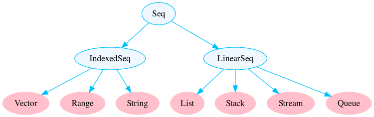
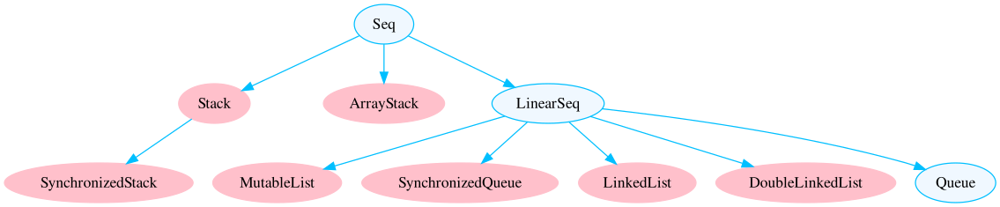
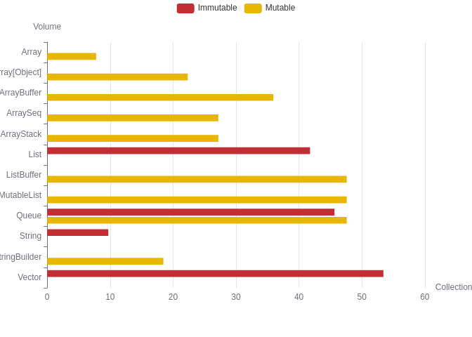

Scala Data Collections Performance
================

Scala has different data collections and using the proper objects is
important in optimizing the big data pipelines.

This post tries to study the characteristics of the Scala collection,
such as:

-   Memory Usage,

-   Operations Time.

from the point of view of practical benchmarks. We will try to study the
performance of data collection in two posts; part one related to
`Sequence` collection, the second contains `Maps` and `Sets`. The
diagram below demonstrates all of the collections in the package
`scala.collection`. These are all high-level abstract classes or traits
with both mutable and immutable implementations.


## Sequence Type

The `Seq` trait represents sequences. A sequence is a type of iterable
with a length and elements with fixed index positions beginning at 0.
`Seq` Collection divided to type of immutable and mutable. The following
figure shows all `Seq` collections in package
`scala.collection.immutable`.



And the following figure shows `Seq` collections in package
`scala.collection.mutable`.




Before seeing the collection benchmark tables, it is useful to review
the collection definition and its properties.

<table>
<thead>
<tr>
<th style="text-align:left;">
Immutability
</th>
<th style="text-align:left;">
Collection
</th>
<th style="text-align:left;">
description
</th>
</tr>
</thead>
<tbody>
<tr>
<td style="text-align:left;">
Immutable
</td>
<td style="text-align:left;">
List
</td>
<td style="text-align:left;">
A List is a collection that contains immutable data. The Scala List
class holds a sequenced, linear list of items.
</td>
</tr>
<tr>
<td style="text-align:left;">
Immutable
</td>
<td style="text-align:left;">
Stream
</td>
<td style="text-align:left;">
The Stream is a lazy list where elements are evaluated only when they
are needed. Streams have the same performance characteristics as lists.
</td>
</tr>
<tr>
<td style="text-align:left;">
Immutable
</td>
<td style="text-align:left;">
Vector
</td>
<td style="text-align:left;">
Vectors in Scala are immutable data structures providing random access
for elements and is similar to the list. But, the list has incompetence
of random access of elements.
</td>
</tr>
<tr>
<td style="text-align:left;">
Immutable
</td>
<td style="text-align:left;">
Queue
</td>
<td style="text-align:left;">
A Queue is a first-in, first-out (FIFO) data structure. Scala offers
both an immutable queue and a mutable queue. A mutable queue can be
updated or extended in place. It means one can change, add, or remove
elements of a queue as a side effect. Queue is implemented as a pair of
lists. One is used to insert the elements and the second to contain
deleted elements. Elements are added to the first list and removed from
the second list. The two most basic operations of Queue are Enqueue and
Dequeue.
</td>
</tr>
<tr>
<td style="text-align:left;">
Immutable
</td>
<td style="text-align:left;">
Stack
</td>
<td style="text-align:left;">
A Stack is a data structure that follows the last-in, first-out(LIFO)
principle. We can add or remove element only from one end called top.
Scala has both mutable and immutable versions of a stack.
</td>
</tr>
<tr>
<td style="text-align:left;">
Immutable
</td>
<td style="text-align:left;">
Range
</td>
<td style="text-align:left;">
The Range can be defined as an organized series of uniformly separated
Integers. It is helpful in supplying more strength with fewer methods,
so operations performed here are very quick.
</td>
</tr>
<tr>
<td style="text-align:left;">
Immutable
</td>
<td style="text-align:left;">
String
</td>
<td style="text-align:left;">
A string is a sequence of characters. In Scala, objects of String are
immutable which means they are constant and cannot be changed once
created.
</td>
</tr>
<tr>
<td style="text-align:left;">
Mutable
</td>
<td style="text-align:left;">
ArrayBuffer
</td>
<td style="text-align:left;">
To create a mutable, indexed sequence whose size can change, the
ArrayBuffer class is used. Internally, an ArrayBuffer is an Array of
elements, as well as the store’s current size of the array. When an
element is added to an ArrayBuffer, its size is checked. If the
underlying array isn’t full, then the element is directly added to the
array. If the underlying array is full, then a larger array is
constructed and all the elements are copied to the new array. The key is
that the new array is constructed larger than what is required for the
current addition.
</td>
</tr>
<tr>
<td style="text-align:left;">
Mutable
</td>
<td style="text-align:left;">
ListBuffer
</td>
<td style="text-align:left;">
The ListBuffer object is convenient when we want to build a list from
front to back. It supports efficient prepend and append operations. The
time taken to convert the ListBuffer into a List is constant.
</td>
</tr>
<tr>
<td style="text-align:left;">
Mutable
</td>
<td style="text-align:left;">
StringBuilder
</td>
<td style="text-align:left;">
A String object is immutable. When you need to perform repeated
modifications to a string, we need a StringBuilder class. A
StringBuilder is utilized to append input data to the internal buffer.
Numerous operations like appending data, inserting data, and removing
data are supported in StringBuilder.
</td>
</tr>
<tr>
<td style="text-align:left;">
Mutable
</td>
<td style="text-align:left;">
MutableList
</td>
<td style="text-align:left;">
A MutableList consists of a single linked list together with a pointer
that refers to the terminal empty node of that list. This makes list
append a constant time operation because it avoids having to traverse
the list in search for its terminal node.
</td>
</tr>
<tr>
<td style="text-align:left;">
Mutable
</td>
<td style="text-align:left;">
ArraySeq
</td>
<td style="text-align:left;">
Array sequences are mutable sequences of a fixed size that store their
elements internally in an Array\[Object\]. You would typically use an
ArraySeq if you want an array for its performance characteristics, but
you also want to create generic instances of the sequence where you do
not know the type of the elements and you do not have a ClassTag to
provide them at run-time.
</td>
</tr>
<tr>
<td style="text-align:left;">
Mutable
</td>
<td style="text-align:left;">
ArrayStack
</td>
<td style="text-align:left;">
An ArrayStack is a MutableStack that contains a FastList of data.
ArrayStack iterates from top to bottom (LIFO order). The backing data
structure grows and shrinks by 50% at a time, and size is constant.
ArrayStack does not extend Vector, as does the Java Stack, which was one
of the reasons for creating this data structure.
</td>
</tr>
<tr>
<td style="text-align:left;">
Mutable
</td>
<td style="text-align:left;">
Array
</td>
<td style="text-align:left;">
Array is a special mutable kind of collection in Scala. it is a fixed
size data structure that stores elements of the same data type.
</td>
</tr>
</tbody>
</table>

### Benchmark Codes

We created a Scala project with a sbt for assessment data collection.

``` sbt
// build.sbt
scalaVersion := "2.12.3"
libraryDependencies += "org.apache.spark" %% "spark-core" % "3.1.2"
libraryDependencies += "org.apache.spark" %% "spark-sql" % "3.1.2"
enablePlugins(PackPlugin)
```

To calculate the size of an object, I find
`org.apache.spark.util.SizeEstimator.estimate`  function is useful. This
function estimates the sizes of Java objects (number of bytes of memory
they occupy).

``` scala
import org.apache.spark.sql._
import org.apache.spark.sql.functions.col
import org.apache.spark.util.SizeEstimator.estimate
import scala.collection.AbstractSeq
import scala.collection.mutable
import scala.collection.mutable.{ArrayBuffer, ListBuffer}
```

To create a result dataframe and write the result, we use Spark (it is
not necessary).

``` scala
val spark = SparkSession
  .builder()
  .appName("Collection_Benchmark")
  .master("local[2]")
  .getOrCreate()

import spark.implicits._
```

We need a time-elapsing function to calculate run time, so use
’System.nanoTime\` to measure time in nano resolution.

``` scala
def timeElapsing(benchmarkFunction: => Unit, message:Boolean = false)(times:Int = 1): Double = {
  if(message) println("Benchmark: IS Starting ...")
  val startTime = System.nanoTime()
  for (_ <- 0 until times)
    benchmarkFunction
  val endTime = System.nanoTime()
  val timeElapsed = (endTime - startTime).toDouble / times.toDouble
  if(message) println(s"Operation Took $timeElapsed ms on average")
  timeElapsed
}
```

Among all the data collections, only some of them have an `insert`
method. We define `insertTime` function only for these collections, as
you see below.

``` scala
def insertTime(x:AbstractSeq[Int], n:Int, m:Int):Double = x match {
  case x:ArrayBuffer[Int] => timeElapsing(x.updated(m,0))(n)
  case x:ListBuffer[Int] => timeElapsing(x.updated(m,0))(n)
  case x:mutable.MutableList[Int] => timeElapsing(x.updated(m,0))(n)
  case x:mutable.Queue[Int] => timeElapsing(x.updated(m,0))(n)
  case x:mutable.ArrayStack[Int] => timeElapsing(x.updated(m,0))(n)
  case _ => -1
}
```

The main parts of the benchmark are `benchmark***` functions, which
contain the time-elapsed of the main methods.

``` scala
def benchmarkSeq(x:AbstractSeq[Int], n:Int, m:Int): Map[String, Double] = {
  Map(
    "volume" -> estimate(x),
    "head" -> timeElapsing(x.head)(n),
    "tail" -> timeElapsing(x.tail)(n),
    "apply" -> timeElapsing(x.apply(m))(n),
    "update" -> timeElapsing(x.updated(m,0))(n),
    "prepend" -> timeElapsing(0+:x)(n),
    "append" -> timeElapsing(x:+0)(n),
    "insert" -> insertTime(x, n, m)
  )
}
```

Similar to `benchmarkSeq` we define `benchmarkString`,
`benchmarkStringBuilder` and `benchmarkArray` functions.

To calculate correct time elapsing related to Array we define
`Array[Object]`

``` scala
def obj = new Object()
def benchmarkArrayBoxed(x:Array[Object], n:Int, m:Int): Map[String, Double] =  { Map(
  "volume" -> estimate(x),
  "head" -> timeElapsing(x.head)(n),
  "tail" -> timeElapsing(x.tail)(n),
  "apply" -> timeElapsing(x.apply(m))(n),
  "update" -> timeElapsing(x.updated(m,0))(n),
  "prepend" -> timeElapsing(obj+:x)(n),
  "append" -> timeElapsing(x:+obj)(n),
  "insert" -> timeElapsing(x.updated(m,0))(n))
}
```

When determining the size of objects, we consider two measurements: size
and method. Objects with a length of
16<sup>0</sup>, 16<sup>1</sup>, ..., 16<sup>5</sup> are generated to
find their size. For checking the performance of methods, objects with a
size of 10000, 200000, ..., 1000000 are generated.

``` scala
val sizes = ( 0 to 5).map(x => math.pow(16,x).toInt) ++ (1 to 10).map(_*100000)
```

As you can see below, each method is run 100 times on objects, and the
results are collected.

``` scala
val stats = for(s <- sizes) yield {
  val integers = 0 until s
  List(
    ("Immutable_List", integers.toList),
    ("Immutable_Stream", integers.toStream),
    ("Immutable_Vector", integers.toVector),
    ("Immutable_Queue", scala.collection.immutable.Queue(integers: _*)),
    ("Immutable_Range", integers),
    ("Immutable_String", "1" * s),
    ("Mutable_ArrayBuffer", scala.collection.mutable.ArrayBuffer(integers: _*)),
    ("Mutable_ListBuffer", scala.collection.mutable.ListBuffer(integers: _*)),
    ("Mutable_StringBuilder", new scala.collection.mutable.StringBuilder("1" * s)),
    ("Mutable_MutableList", scala.collection.mutable.MutableList(integers: _*)),
    ("Mutable_Queue", scala.collection.mutable.Queue(integers: _*)),
    ("Mutable_ArraySeq", scala.collection.mutable.ArraySeq(integers: _*)),
    ("Mutable_ArrayStack", scala.collection.mutable.ArrayStack(integers: _*)),
    ("Mutable_Array", integers.toArray),
    ("Mutable_Boxed_Array", {
      val boxedArray = new Array[Object](s)
      var i = 0
      while (i < s) {
        boxedArray(i) = obj; i += 1
      }
      boxedArray
    })

  ).map {
    case (c, cl: AbstractSeq[Int]) => Map("size" -> s.toString, "collection" -> c) ++ 
    benchmarkSeq(cl, 100, s - 1).map(x => (x._1, x._2.toString))
    case (c, cl: Array[Object]) => Map("size" -> s.toString, "collection" -> c) ++ 
    benchmarkArrayBoxed(cl, 100, s - 1).map(x => (x._1, x._2.toString))
    case (c, cl: Array[Int]) => Map("size" -> s.toString, "collection" -> c) ++ 
    benchmarkArray(cl, 100, s - 1).map(x => (x._1, x._2.toString))
    case (c, cl: String) => Map("size" -> s.toString, "collection" -> c) ++ 
    benchmarkString(cl, 100, s - 1).map(x => (x._1, x._2.toString))
    case (c, cl: StringBuilder) => Map("size" -> s.toString, "collection" -> c) ++ 
    benchmarkStringBuilder(cl, 100, s - 1).map(x => (x._1, x._2.toString))
  }
}
```

The last step is writing the results as a csv file with `spark.write`.

``` scala
val colNames = stats(0).head.toList.sortBy(_._1).map(_._1)
  .zipWithIndex.map(x => col("value")(x._2).as(x._1))

stats.flatten.map(x => x.toList.sortBy(_._1).map(_._2))
  .toDF.select(colNames:_*)
  .coalesce(1).write.option("header","true").mode("overwrite")
  .csv("./collection_seq_size_benchmark.csv")
```

### Object Size in Memory

The benchmark data is now available! The table below displays the
expected size of various collections of different sizes in bytes.

The average memory size of each object is calculated and shown below.

<!-- -->

### Methods Performance

Before seeing the benchmark result, it is better to have an overview of
the methods that are applied to objects. The below table has more
details.

We can find performance characteristics of Scala collections in the
[Scala
documents](https://docs.scala-lang.org/overviews/collections/performance-characteristics.html).
The Scala performance table is provided below for comparison with the
empirical results.

The performance results of each method and collection are plotted as a
scatter plot. We add a regression line to the plot to see the growth
rate. The plot below shows the performance of the immutable collection.


A similar plot is plotted for mutable collection.


In this post, we try to understand the size and performance of the
`Sets` and `Maps` data collection. In the first, we review the structure
of the Mutable and Immutabla `Sets` and `Maps`collections.


A quick review of each collection application may be found in the table
below.

### Benchmark Codes

The benchmark codes in this section are more similar to the `Seq`
Collection benchmark codes from a previous post. Only the benchmark
functions for `Sets` and `Maps` are different. The `Map` benchmark code
can be found here.

``` scala
  def benchmarkMap(x:scala.collection.Map[Int,Int], n:Int, m:Int): Map[String, Double] = {
    Map(
      "volume" -> estimate(x),
      "lookup" -> timeElapsing(x.get(m))(n),
      "add" -> timeElapsing(x ++ Map((m,m)))(n),
      "remove" -> timeElapsing(x-0)(n),
      "min" -> timeElapsing(x.minBy(_._2)._1)(n)
    )
  }
```

Similar to `Map`, we define a benchmark function for `Set`.

``` scala
  def benchmarkSet(x:scala.collection.Set[Int], n:Int, m:Int): Map[String, Double] = {
    Map(
      "volume" -> estimate(x),
      "lookup" -> timeElapsing(x.contains(m))(n),
      "add" -> timeElapsing(x ++ Map((m,m)))(n),
      "remove" -> timeElapsing(x-0)(n),
      "min" -> timeElapsing(x.min)(n)
    )
  }
```

In the below code, the definition of each collection can be found.

``` scala
  val stats: Seq[List[Map[String, String]]] = for(s <- sizes) yield {
    val integers = 0 until s
    List(
      ("Immutable_HashMap", integers.zipWithIndex.toMap),
      ("Immutable_TreeMap", scala.collection.immutable.TreeMap(integers.zipWithIndex:_*)),
      ("Immutable_ListMap",scala.collection.immutable.ListMap(integers.zipWithIndex:_*)),
      ("Mutable_HashMap", scala.collection.mutable.HashMap(integers.zipWithIndex:_*)),
      ("Mutable_WeakHashMap",scala.collection.mutable.WeakHashMap(integers.zipWithIndex:_*))
    ).map(x => {
      Map("size" -> s.toString, "collection" -> x._1) ++ 
        benchmarkMap(x._2, 100, s).map(x => (x._1, x._2.toString))
    }) ++  List(
      ("Immutable_HashSet", integers.toSet),
      ("Immutable_TreeSet", scala.collection.immutable.TreeSet(integers:_*)),
      ("Immutable_BitSet", scala.collection.immutable.BitSet(integers:_*)),
      ("Mutable_HashSet", scala.collection.mutable.HashSet(integers:_*)),
      ("Mutable_BitSet", scala.collection.mutable.BitSet(integers:_*)),
      ("Mutable_TreeSet", scala.collection.mutable.TreeSet(integers:_*))
    ).map(x => {
      Map("size" -> s.toString, "collection" -> x._1) ++ 
        benchmarkSet(x._2, 100, s).map(x => (x._1, x._2.toString))
    })

  }
```

### Object Size in Memory

The benchmark information is now ready. The table below shows the
estimated size in bytes of various collections of varied sizes.

The average memory size of each object is calculated and shown below.

<!-- -->

### Methods Performance

The table below contains a list of the data collection methods used.

Scala collection performance characteristics can be found in the [Scala
documents](https://docs.scala-lang.org/overviews/collections/performance-characteristics.html).
For comparison with the empirical results, the Scala performance table
is given below.

The performance results of each method and collection are shown using a
scatter plot. We add a regression line to the plot to see the growth
rate.


A similar plot is plotted for mutable collection.


# Refrences

-   [Performance
    Characteristics](https://docs.scala-lang.org/overviews/collections/performance-characteristics.html)
-   [Benchmarking Scala
    Collections](https://www.lihaoyi.com/post/BenchmarkingScalaCollections.html)
